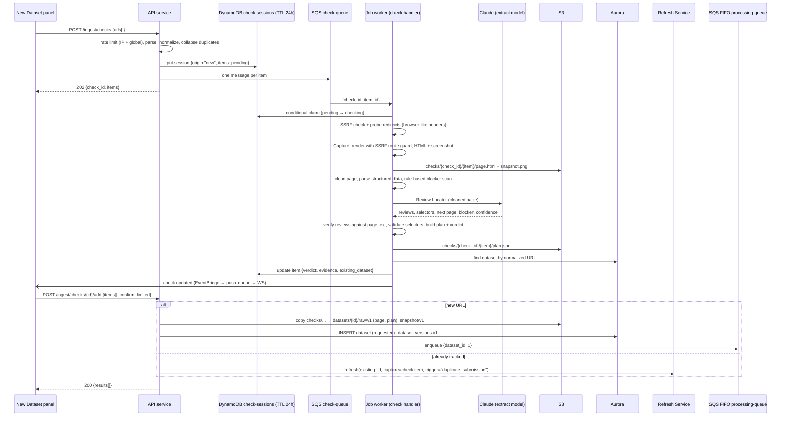

# Design Document

## Overview

URL ingestion runs in two asynchronous steps so that up to 10 URLs can be checked without hitting API Gateway's 29-second limit, and so the work spreads across any number of worker instances.

1. **Check:** `POST /ingest/checks` creates a Check Session in DynamoDB and sends one message per URL to `check-queue`. A job worker (Lambda or container) takes each message and:
   - probes the URL (redirects, status);
   - renders it with the in-process Capture module;
   - runs the **Review Locator** (AI, from `review-extraction`) on the cleaned page to find the reviews, then verifies them and validates reusable selectors;
   - builds an **Extraction Plan** and a **Verdict**;
   - looks for an existing dataset with the same normalized URL;
   - writes the result to the session.

   Results reach the browser through the Realtime Channel (`check.updated` events), with polling as a fallback.
2. **Add:** `POST /ingest/checks/{id}/add` takes the chosen URLs. New URLs become datasets. Already-tracked URLs go to the shared **Refresh Service**, which uses the Check's capture and Extraction Plan as the next data version. `wont_work` URLs are refused. `limited` URLs need `confirm_limited: true`.

The Library's **Refresh** action uses the same Check machinery with `origin = "refresh"` (Requirement 6.9). A refresh therefore always starts from a fresh capture, a fresh AI reading of the page, and a fresh verdict.

Uploads go straight from the browser to S3 through a pre-signed URL, then are previewed and submitted by reference. This is needed because Lambda request payloads are capped at 6 MB, below the 10 MB upload limit.

## Architecture



## Components and Interfaces

### API endpoints

| Method | Path | Body | Responses |
|---|---|---|---|
| POST | `/ingest/checks` | `{ urls: string[] }` (1–10) | 202 `{check_id, items:[{item_id, input, normalized, state:"pending" \| "invalid" \| "duplicate_in_batch"}]}`; 429 when rate-limited |
| GET | `/ingest/checks/{check_id}` | – | 200 session with every item's state, verdict, and evidence (polling fallback); 404 if expired |
| POST | `/ingest/checks/{check_id}/items/{item_id}/retry` | – | 202; re-queues one item that ended in `error` or timed out; 429 when rate-limited |
| POST | `/ingest/checks/{check_id}/add` | `{ items: [{item_id, confirm_limited?: bool}] }` | 200 `{results:[{item_id, outcome, dataset_id?, message}]}` |
| POST | `/uploads` | `{ filename, size_bytes, content_type }` | 201 `{upload_id, put_url, expires_at}` (pre-signed PUT to `uploads/{upload_id}/file`, 15 minutes, content-length limited to `MAX_UPLOAD_MB`); 422 if too large; 429 when rate-limited |
| POST | `/uploads/{upload_id}/preview` | – | 200 `{columns, suggested_mapping, sample_rows, usable_rows, will_keep, keep_rule}`; 422 with a reason (upload deleted) |
| POST | `/datasets/upload` | `{ upload_id, name, mapping, description? }` | 201 `{id}`; 422 |

`outcome` is one of `created`, `refreshed`, `restored_and_refreshed`, `already_refreshing`, `refused_wont_work`, `needs_confirmation`, or `expired`.

Check and item IDs are random UUIDs. The app has no accounts, so anyone holding a check ID can view and add its results; the IDs aren't listed anywhere.

### Backend modules

- `ingestion.url_normalizer.normalize(url) -> str`: implements Requirement 6.1. The tracking-parameter list comes from configuration.
- `ingestion.url_validator`
  - `assert_public_host(url)`: resolves DNS and rejects private, loopback, link-local, and metadata ranges. It re-checks after every redirect hop. Hosts in `SSRF_TEST_ALLOW_HOSTS` are allowed (test environments only).
  - `probe(url) -> ProbeResult{final_url, status, hops[]}`: `httpx` with manual redirects so every hop is SSRF-checked and logged. It sends a current desktop Chrome `User-Agent`, `Accept`, and `Accept-Language` header set.
- `handlers.check.CheckHandler` (queue `check`), idempotent:
  1. Claim the item with a conditional DynamoDB update (`state = pending` or `error` → `checking`, with `claimed_at`). If the claim fails because another instance holds it and `claimed_at` is recent, drop the message.
  2. Probe → Capture to `checks/{check_id}/{item_id}/` → Viability (below) → duplicate lookup → write the item → publish `check.updated`. The whole item is limited to `CHECK_TIMEOUT_S` (default 60).
  3. When the session's `origin` is `refresh`, apply Requirement 6.9: call the Refresh Service, leave the item `awaiting_confirmation`, or append a failed-refresh event through `db.status.log_event()`.
- `capture.render(url, prefix) -> CaptureResult` (in-process in the workers image):
  - Playwright Chromium with a 1280×900 viewport; one browser per worker process, reused across messages, with a fresh context per message.
  - `page.route("**/*")` guard: every request the browser makes is resolved and SSRF-checked; blocked requests are aborted.
  - Waits for `networkidle` (capped at 15 s), scrolls once to trigger lazy-loaded reviews, then saves the HTML, a screenshot, and the title.
  - Returns the main document's response status and `page.url`. When `page.url` differs from the URL requested, the check records a `client_redirect` hop and uses `page.url` as the Final URL.
- `ingestion.viability.assess(capture, final_url, robots) -> (Verdict, ExtractionPlan)`: see below.
- `ingestion.robots.check(final_url) -> RobotsResult`: fetches `robots.txt` (SSRF-checked, 3-second timeout) and evaluates it for the `*` user agent. A failure to fetch is treated as "no restriction."
- `ingestion.duplicates.find_existing(normalized_target, normalized_final) -> Dataset | None`: queries both normalized columns, including archived datasets.
- `ingestion.service.add_items(check_id, items)`: for each item: refuses `wont_work`; asks for confirmation on `limited`; calls `create_from_check()` for new URLs; calls `refresh_service.refresh()` for tracked URLs. Marks each item `applied` with a conditional update, so a double-clicked Add or two instances can't create two datasets. It also handles the unique-constraint race: when an insert fails because a concurrent request created the same normalized URL, it falls back to refreshing that dataset.
- `datasets.refresh_service.refresh(dataset_id, trigger, capture: CheckCapture | UploadCapture)` (**shared with `dataset-library`**). A capture is always required; the caller produces it through a Check or an upload.
  - If the dataset is `requested` or `processing`, returns `already_refreshing`.
  - If the dataset is archived, clears `archived_at` and returns `restored_and_refreshed`.
  - Otherwise increments `data_version`, copies the capture (page, plan, and snapshot for URLs; file and mapping for uploads) to `raw/v{n}`, inserts a `dataset_versions` row with `trigger`, transitions to `requested` with a `refresh_requested` event, and enqueues processing. The version increment and row insert happen in one transaction guarded by `WHERE status NOT IN ('requested','processing')`, so concurrent refreshes produce exactly one new version.
- `ingestion.upload_parser`: reads the object from S3, uses the `csv` sniffer, applies the header synonym table (for example `review|text|comment|body` → text, `rating|stars|score` → rating), counts usable rows, and applies the `MAX_REVIEWS` keep rule for the preview.
- `ingestion.service.create_from_upload(upload_id, name, mapping, description)`: re-validates, copies `uploads/{upload_id}/file` to `datasets/{id}/raw/v1/upload.csv`, writes `raw/v1/mapping.json` (mapping plus keep rule), inserts the dataset and version 1 record, and enqueues processing.

### Viability assessment (AI-first)

`assess()` runs these steps. The page cleaner, structured-data parser, Review Locator, verifier, and selector validator all live in the Extraction Engine (`app.extraction`, spec `review-extraction`) and are shared with the processing worker. Steps 2–6 are a single call to `extraction.build_plan()`.

1. **Rule-based pre-scan (free):** empty shell (less than 300 characters of visible text), obvious challenge pages (CAPTCHA widgets, "verify you are human", known bot-protection fingerprints), and login or paywall pages (a dominant password form). A certain blocker stops here with `wont_work` and no AI call.
2. **Structured data (free):** JSON-LD and microdata `Review` and `AggregateRating` objects.
3. **Review Locator (AI):** one call with the cleaned page. It returns candidate reviews with element references, suggested item and field selectors, the next-page link, the reported total, any blocker it recognizes, the entity name, and a confidence level.
4. **Verification:** each candidate review's text must appear in the page's visible text after whitespace and Unicode normalization; the rest are dropped and counted.
5. **Selector validation:** the suggested selectors are applied to the captured HTML. They are valid when they reproduce at least `SELECTOR_MIN_AGREEMENT` (default 80%) of the verified reviews with matching text.
6. **Method choice** (recorded in the plan):
   - `selectors` when they validate;
   - `structured` when structured data holds more verified reviews than the Locator found and the texts agree;
   - otherwise `ai_direct`, meaning each page is read by the AI.
7. **Verdict** by the rules in Requirement 3.4–3.6, with plain-language reasons.

If the AI is unavailable or over the global limit, steps 3–5 are skipped, the method is `structured` if structured data exists, and the verdict is at most `limited` (Requirement 3.13).

```json
{
  "verdict": "will_work",
  "reasons": ["24 reviews found and verified on this page", "Next page link found"],
  "warnings": [],
  "evidence": { "reviews_verified": 24, "reviews_rejected": 0, "method": "selectors",
                "pagination": true, "reported_total": 1540, "blocker": null,
                "locator_confidence": "high", "page_title": "Acme CRM Reviews",
                "main_status": 200,
                "samples": [ { "text": "Setup took an afternoon…", "rating": 5, "date": "2026-09-02" } ] }
}
```

### Frontend

The **New Dataset panel** layout is owned by `dataset-library`. This spec supplies its contents:

- **URL tab:** a multi-line input (maximum 10 lines) and a **Check URLs** button, followed by a results list with one card per URL:
  - A verdict badge (✓ Will work / ⚠ Limited / ✕ Won't work) with text, not color alone
  - Reasons, warnings, and evidence (for example "24 reviews found · read with page selectors · more pages found · 1,540 reported")
  - Two or three sample reviews, expandable, so the analyst can see what was detected
  - An "Already tracked as *Acme CRM* — will refresh" note with a link, when the URL is tracked (or "Already tracked — page can't be read right now; existing data unchanged" for a tracked `wont_work`)
  - A Retry link on items that ended in `error` or timed out
  - A checkbox to include the URL. It is off and disabled for `wont_work`, and on by default for the others
  - Then **Add selected**. A confirmation lists the `limited` items and how each item will be handled (new or refresh)
- **Upload tab:** dropzone → pre-signed upload with a progress bar → preview table with detected mapping and a "N rows usable; the most recent 1,000 will be kept" note when over the limit → column mapper → name → submit.
- After Add, a results summary lists each URL's outcome (created / refreshed / restored and refreshed / already refreshing).
- The panel keeps the current `check_id` in the URL (`?check=…`), so reloading the page keeps the results.

## Data Models

### DynamoDB `check-sessions` (TTL 24 h)

```json
{ "check_id": "uuid", "created_at": "ISO", "ttl": 1727600000,
  "origin": "new" | "refresh", "refresh_dataset_id": null,
  "items": [ { "item_id": "u1", "input": "…", "normalized": "…", "final_url": "…",
               "state": "pending|checking|done|invalid|duplicate_in_batch|error|awaiting_confirmation|applied",
               "claimed_at": "ISO", "hops": [ ], "verdict": { },
               "existing_dataset": { "id": "…", "name": "…", "archived": false, "status": "updated" },
               "capture_prefix": "checks/{check_id}/u1/" } ] }
```

Items are stored as a map keyed by `item_id` so each item can be updated independently with a conditional expression.

S3 lifecycle rules delete `checks/` and `uploads/` objects after 1 day.

### Extraction Plan (`plan.json`)

Defined in `review-extraction`. Summary: `{method, selectors?, rating_scale, next_page_rule, first_page: {verified, discarded, structured_count, per_page_rate}, reported_total, entity_hint, confidence, locator_model, prompt_version, degraded}`.

### Additions to `datasets` (migration in this spec)

- `normalized_url text` with a **unique partial index** `WHERE source_type = 'url'`
- `normalized_final_url text`, indexed (not unique)
- `status_detail.viability`: Verdict and evidence at the time the dataset was added or last refreshed; review-analysis adds `actual` next to it

### `dataset_versions` table (shared with `review-analysis`, `dataset-library`, and `guardrailed-chat`)

| Column | Type | Notes |
|---|---|---|
| `dataset_id` | UUID FK | PK part 1 |
| `version` | int | PK part 2 |
| `trigger` | text | `initial`, `manual_refresh`, `duplicate_submission`, `upload_replace` |
| `requested_at` | timestamptz | |
| `completed_at` | timestamptz null | Set by review-analysis |
| `review_count` | int null | Set by review-analysis |
| `extraction_method` | text null | `selectors`, `ai_direct`, `structured`, or `upload`; set by review-analysis |
| `outcome` | text null | `updated` or `failed` |

A refresh whose Check ends in `wont_work` never creates a version row. Nothing about the data changed, so earlier answers are still valid. It is recorded only as a failed-refresh event in `status_detail`.

## Correctness Properties

Properties are tested with Hypothesis; the concurrency properties use a model-based state machine against PostgreSQL and LocalStack.

1. **Normalization is idempotent.** *For any* URL, `normalize(normalize(u))` SHALL equal `normalize(u)`. _Validates: Requirement 6.1_
2. **Cosmetic URL changes don't matter.** *For any* URL, adding tracking parameters, reordering query parameters, adding a fragment, toggling `www.`, changing host case, or adding a trailing slash SHALL NOT change the normalized URL. _Validates: Requirements 6.1, 6.2_
3. **Private addresses are always refused.** *For any* IPv4 or IPv6 address in a private, loopback, link-local, or metadata range, `assert_public_host` SHALL refuse it, including when reached through a redirect. _Validates: Requirement 1.3_
4. **Verdict rules are consistent.** *For any* plan outcome, a blocker or zero verified reviews SHALL give `wont_work`, and `will_work` SHALL only be given with at least the minimum verified reviews and no blocker. _Validates: Requirements 3.4, 3.5, 3.6_
5. **Won't-work URLs never become data.** *For any* sequence of Add requests, no dataset or data version SHALL be created from an item whose verdict is `wont_work`. _Validates: Requirement 3.8_
6. **One dataset per URL.** *For any* interleaving of concurrent Add requests for URLs with the same normalized form, exactly one dataset SHALL exist for that URL afterward. _Validates: Requirements 6.2, 6.4, 6.7_
7. **One new version per refresh.** *For any* number of concurrent refresh calls on a dataset that is not processing, `data_version` SHALL increase by exactly one. _Validates: Requirement 6.6_

## Error Handling

| Condition | Result |
|---|---|
| Malformed line | Item `invalid`, other lines still checked |
| Private or blocked IP, including a blocked sub-request during render | `wont_work`, reason "Address not allowed" |
| Final status not 200 (probe or browser) | `wont_work` with the status |
| More than 10 redirects, or a loop | `wont_work` "Too many redirects" |
| Check longer than `CHECK_TIMEOUT_S` | `wont_work` "Page took too long to load", with Retry |
| Review Locator returns invalid JSON | One repair retry; then treated as AI unavailable |
| AI unavailable or global AI limit reached | Structured data only; verdict at most `limited`, reason "AI page reading unavailable" |
| Check handler crashes | SQS retries; after the final attempt the item becomes `error` with Retry |
| Duplicate or concurrent delivery of a check message | Conditional claim; the second instance drops it |
| Add after the session expired | `expired`; the UI asks the analyst to check again |
| Concurrent Add of the same item or the same normalized URL | Conditional `applied` update and unique index; the loser refreshes the winner's dataset or reports `already_refreshing` |
| Enqueue fails after insert | Record kept; the sweeper in review-analysis re-enqueues it |
| Rate limit exceeded | 429 with `Retry-After`; the panel says when checks can resume |
| Upload larger than the limit | Refused before a pre-signed URL is issued; S3 also enforces the content-length limit |
| Upload invalid at preview | 422 with reason; the object is deleted |

A verdict is a prediction, not a guarantee. The actual outcome is recorded next to it, and the summary page shows both. Together with the extraction evaluation suite in `review-extraction`, this is how the prompts and thresholds get tuned.

## Testing Strategy

- **Unit tests:** URL normalizer (tracking parameters, `www`, trailing slash, query order, fragment, case); SSRF (IPv4 and IPv6, rebinding after a redirect, metadata IPs, test allowlist); probe headers; client-side redirect recording; robots parsing; the rule-based pre-scan; verdict rules from a table of Locator and verification outcomes (no AI needed); method choice; AI-unavailable fallback.
- **Unit tests for the Refresh Service:** processing → `already_refreshing`; archived → restored; capture and plan copied; version row inserted with the right trigger; two concurrent calls → one new version.
- **Integration tests (AI stub with recorded Locator responses):** the fixtures container serves each HTML fixture and redirect scenario (allowed through `SSRF_TEST_ALLOW_HOSTS`). The check handler end-to-end writes the DynamoDB item, the plan, and publishes `check.updated`. The capture route guard blocks a page that loads an image from `127.0.0.1`. For Add: new URL → dataset v1 plus enqueue; tracked URL → no new row, version 2, `refresh_requested` event; archived tracked URL → restored; tracked URL while processing → `already_refreshing`; two concurrent adds of the same URL → one dataset; double-submitted Add → one dataset; expired session. Refresh-origin checks: `will_work` → refresh starts with no Add call; `wont_work` → no version row, failed-refresh event. Uploads: pre-signed flow, preview over the row limit, invalid file deleted.
- **Scale test (with platform-foundation):** the same check message delivered to two worker instances produces one result.
- **Verdict accuracy:** `assess()` is added to the extraction evaluation suite from `review-extraction`, which reports verdict accuracy against the labeled pages; the job fails below 0.90.
- **Frontend tests:** multi-line parsing and the 10-line limit, verdict cards, badges, samples, and warnings, disabled `wont_work` checkbox, per-item Retry, limited-confirmation dialog, "Already tracked" notes, results summary, 429 message, reload keeping `?check=`, upload progress and over-limit note.
- **E2E (against the public fixture site):** paste three fixture URLs (one of each verdict), check, add; confirm the `wont_work` URL is refused and the others appear in the Library. Paste an existing dataset's URL with `?utm_source=x`; confirm no new row appears and the existing row goes back to `requested`.
