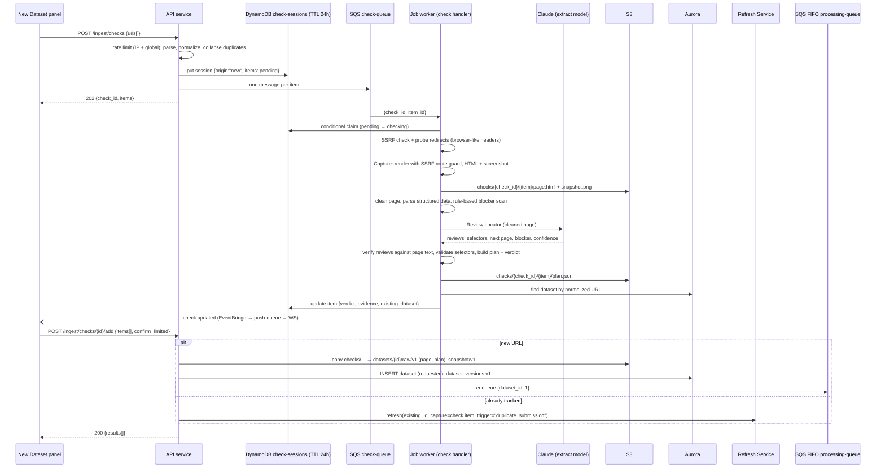

# Design Document

## Overview

URL ingestion runs in two asynchronous steps so that up to 10 URLs can be checked without hitting API Gateway's 29-second limit, and so the work spreads across any number of worker instances.

1. **Check:** `POST /ingest/checks` creates a Check Session in DynamoDB and sends one message per URL to `check-queue`. A job worker (Lambda or container) takes each message and:
   - probes the URL (redirects, status);
   - renders it with the in-process Capture module;
   - runs the **Review Locator** (AI, from `review-extraction`) on the cleaned page to find the reviews, then verifies them and validates reusable selectors;
   - builds an **Extraction Plan** and a **Verdict**;
   - looks for an existing dataset with the same normalized URL;
   - writes the result to the session.

   Results reach the browser through the Realtime Channel (`check.updated` events), with polling as a fallback.
2. **Add:** `POST /ingest/checks/{id}/add` takes the chosen URLs. New URLs become datasets. Already-tracked URLs go to the shared **Refresh Service**, which uses the Check's capture and Extraction Plan as the next data version. `wont_work` URLs are refused. `limited` URLs need `confirm_limited: true`.

The Library's **Refresh** action uses the same Check machinery with `origin = "refresh"` (Requirement 6.9). A refresh therefore always starts from a fresh capture, a fresh AI reading of the page, and a fresh verdict.

Uploads go straight from the browser to S3 through a pre-signed URL, then are previewed and submitted by reference. This is needed because Lambda request payloads are capped at 6 MB, below the 10 MB upload limit.

A third path, **HTML upload** (Requirement 8), lets the analyst upload the saved HTML of a review page their own browser rendered, for sites the app's own capture can't read. It reuses the Check machinery end to end: the uploaded file *replaces only* the `capture.render(url)` step; everything downstream — the Review Locator, verification, selector validation, method choice, verdict, dataset creation, refresh, and enqueue — runs exactly as it does for a URL. An HTML upload therefore travels through the same `check-queue`, the same `CheckHandler`, the same `check.updated` realtime events and polling fallback, and the same Add step and verdict card. The only new surface is a small amount of API wiring (gate `POST /uploads` to accept HTML, and two thin endpoints to start a Check from an upload and to supply the HTML upload's name/source URL) and an upload-backed capture that produces the same `CaptureResult` shape `assess()` already consumes. The uploaded page is never fetched over the network: `assess()` reads the saved markup only, and the probe, redirect-following, and robots steps are skipped because nothing is retrieved.

## Architecture



### HTML upload path

An HTML upload reuses the Check flow with one substitution: the worker reads the analyst's uploaded HTML instead of rendering a live URL. The analyst first uploads the file (reusing `POST /uploads`), then starts a one-item Check whose item carries an `upload_id` instead of a URL. The `CheckHandler` recognises an upload item, builds an upload-backed capture, and runs the *same* viability assessment, verdict, and duplicate lookup. The verdict reaches the browser through the same `check.updated` events and verdict card; Add then creates a dataset (or routes to the Refresh Service) through the same `ingestion.service`.

```mermaid
sequenceDiagram
  participant UI as New Dataset panel (HTML tab)
  participant API as API service
  participant S3
  participant DDB as DynamoDB check-sessions (TTL 24h)
  participant CQ as SQS check-queue
  participant W as Job worker (check handler)
  participant CL as Claude (extract model)
  participant DB as Aurora
  participant RS as Refresh Service
  participant PQ as SQS FIFO processing-queue
  UI->>API: POST /uploads {filename,size_bytes,content_type: html}
  API-->>UI: 201 {upload_id, put_url, expires_at}
  UI->>S3: PUT saved page (pre-signed, content-length pinned)
  UI->>API: POST /ingest/html-checks {upload_id, source_url?}
  API->>API: rate limit (checks), confirm staged object exists
  API->>DDB: put session {origin:"new", one item: {upload_id, source_url?}}
  API->>CQ: one message {check_id, item_id}
  API-->>UI: 202 {check_id, item_id}
  CQ->>W: {check_id, item_id}
  W->>DDB: conditional claim (pending → checking)
  W->>W: item is an upload → read uploads/{upload_id}/file from S3
  W->>W: build CaptureView (html, synthetic final_url + main_status=200)
  Note over W: probe / redirect / robots SKIPPED — nothing is fetched
  W->>W: clean page, parse structured data, rule-based blocker scan
  W->>CL: Review Locator (cleaned uploaded page)
  CL-->>W: reviews, selectors, next page, blocker, confidence
  W->>W: verify reviews against uploaded text, validate selectors, build plan + verdict
  W->>S3: copy upload → checks/{check_id}/{item}/page.html; write plan.json
  W->>DB: find dataset by normalized source URL (only when source_url given)
  W->>DDB: update item {verdict, evidence, existing_dataset}
  W-)UI: check.updated (EventBridge → push-queue → WS)
  UI->>API: POST /ingest/checks/{id}/add {items[], confirm_limited, name, source_url?, description?}
  alt no source URL, or source URL not tracked
    API->>S3: copy checks/... → datasets/{id}/raw/v1 (page, plan)
    API->>DB: INSERT dataset (source_type html_upload, requested), dataset_versions v1
    API->>PQ: enqueue {dataset_id, 1}
  else source URL already tracked
    API->>RS: refresh(existing_id, capture=CheckCapture(uploaded html+plan), trigger="upload_replace")
  end
  API-->>UI: 200 {results[]}
```

The assessment is **asynchronous through the Check Session**, not a synchronous API call. The reasons mirror the URL check: a single uploaded page still needs the Extraction Engine (one AI call) and the full verification/selector-validation pass, which can exceed API Gateway's 29-second window on a cold worker. Reusing the `check-queue`/Check Session machinery with a single item means the existing check handler, the `check.updated` realtime events, the polling fallback, the verdict card UI, and the Add step are all reused unchanged — the HTML tab is a thin new producer in front of the same pipeline. (A dedicated synchronous `assess`-only endpoint was rejected: it would duplicate the handler, lose the realtime/polling plumbing, and risk a 29-second timeout.)

## Components and Interfaces

### API endpoints

| Method | Path | Body | Responses |
|---|---|---|---|
| POST | `/ingest/checks` | `{ urls: string[] }` (1–10) | 202 `{check_id, items:[{item_id, input, normalized, state:"pending" \| "invalid" \| "duplicate_in_batch"}]}`; 429 when rate-limited |
| GET | `/ingest/checks/{check_id}` | – | 200 session with every item's state, verdict, and evidence (polling fallback); 404 if expired |
| POST | `/ingest/checks/{check_id}/items/{item_id}/retry` | – | 202; re-queues one item that ended in `error` or timed out; 429 when rate-limited |
| POST | `/ingest/checks/{check_id}/add` | `{ items: [{item_id, confirm_limited?: bool, name?, source_url?, description?}] }` | 200 `{results:[{item_id, outcome, dataset_id?, message}]}` |
| POST | `/ingest/html-checks` | `{ upload_id, source_url? }` | 202 `{check_id, item_id, state:"pending"}`; 422 if the staged object is missing or `source_url` is malformed; 429 when rate-limited |
| POST | `/uploads` | `{ filename, size_bytes, content_type }` | 201 `{upload_id, put_url, expires_at}` (pre-signed PUT to `uploads/{upload_id}/file`, 15 minutes, content-length limited to `MAX_UPLOAD_MB`); 422 if too large or the extension/type is not accepted; 429 when rate-limited |
| POST | `/uploads/{upload_id}/preview` | – | 200 `{columns, suggested_mapping, sample_rows, usable_rows, will_keep, keep_rule}`; 422 with a reason (upload deleted) |
| POST | `/datasets/upload` | `{ upload_id, name, mapping, description? }` | 201 `{id}`; 422 |

`outcome` is one of `created`, `refreshed`, `restored_and_refreshed`, `already_refreshing`, `refused_wont_work`, `needs_confirmation`, or `expired`.

`POST /uploads` is **reused** for HTML uploads: its accepted extension/content-type set is widened to include saved pages (`.html`, `.htm`, `.mhtml`) alongside `.csv`/`.tsv` (Requirement 8.1). The extension remains the authoritative gate; `MAX_UPLOAD_MB` and the content-length pin are shared with the tabular path (Requirement 7.1). It stages the file at the same `uploads/{upload_id}/file` key.

`POST /ingest/html-checks` is the only genuinely new endpoint. It starts a one-item Check Session (`origin="new"`) whose single item carries `upload_id` (and the analyst's optional `source_url`) in place of a URL, then enqueues one `check-queue` message. It is rate-limited on the shared `checks` counters. A CSV-style preview endpoint is deliberately **not** added for HTML — the "preview" of an uploaded page is a viability assessment, which is exactly what the Check produces, so it is surfaced through the same verdict card rather than a column preview.

`POST /ingest/checks/{check_id}/add` is **reused** for HTML uploads because an uploaded page is modelled as a Check item. For an HTML item the body additionally carries the required `name`, the optional analyst-supplied `source_url`, and an optional `description`; these are ignored for URL items. Add therefore keeps one code path for both URL and HTML items — refuse `wont_work`, confirm `limited`, create vs refresh, the `applied` claim, and the unique-URL race are all shared.

Check and item IDs are random UUIDs. The app has no accounts, so anyone holding a check ID can view and add its results; the IDs aren't listed anywhere.

### Backend modules

- `ingestion.url_normalizer.normalize(url) -> str`: implements Requirement 6.1. The tracking-parameter list comes from configuration.
- `ingestion.url_validator`
  - `assert_public_host(url)`: resolves DNS and rejects private, loopback, link-local, and metadata ranges. It re-checks after every redirect hop. Hosts in `SSRF_TEST_ALLOW_HOSTS` are allowed (test environments only).
  - `probe(url) -> ProbeResult{final_url, status, hops[]}`: `httpx` with manual redirects so every hop is SSRF-checked and logged. It sends a current desktop Chrome `User-Agent`, `Accept`, and `Accept-Language` header set.
- `handlers.check.CheckHandler` (queue `check`), idempotent:
  1. Claim the item with a conditional DynamoDB update (`state = pending` or `error` → `checking`, with `claimed_at`). If the claim fails because another instance holds it and `claimed_at` is recent, drop the message.
  2. **URL item:** Probe → Capture to `checks/{check_id}/{item_id}/` → Viability (below) → duplicate lookup → write the item → publish `check.updated`. The whole item is limited to `CHECK_TIMEOUT_S` (default 60).
  3. **Upload item** (the item carries `upload_id` instead of a URL): skip the probe, redirect-following, and robots steps (nothing is fetched); build an upload-backed capture (below) from `uploads/{upload_id}/file`; run the *same* Viability assessment and verdict; run the duplicate lookup only when a `source_url` was supplied; write the item and publish `check.updated`. The AI call and verification are still bounded by `CHECK_TIMEOUT_S`.
  4. When the session's `origin` is `refresh`, apply Requirement 6.9: call the Refresh Service, leave the item `awaiting_confirmation`, or append a failed-refresh event through `db.status.log_event()`.
- `capture.render(url, prefix) -> CaptureResult` (in-process in the workers image):
  - Playwright Chromium with a 1280×900 viewport; one browser per worker process, reused across messages, with a fresh context per message.
  - `page.route("**/*")` guard: every request the browser makes is resolved and SSRF-checked; blocked requests are aborted.
  - Waits for `networkidle` (capped at 15 s), scrolls once to trigger lazy-loaded reviews, then saves the HTML, a screenshot, and the title.
  - Returns the main document's response status and `page.url`. When `page.url` differs from the URL requested, the check records a `client_redirect` hop and uses `page.url` as the Final URL.
- `capture.from_upload(upload_id, source_url) -> CaptureView` (in the base image; no browser): reads `uploads/{upload_id}/file` from S3, decodes it as text (rejecting a file that is not readable text with the same specific-message/delete handling as a bad CSV, Requirement 8.2), and returns the existing `viability.CaptureView` with the uploaded markup as `html`. It synthesizes the two fields a live render would have supplied, because there was no HTTP response:
  - `final_url` = the analyst-supplied Source URL when present, otherwise a synthetic placeholder (for example `upload://{upload_id}`) used only as plan context. It is never fetched (Requirements 8.5, 8.8).
  - `main_status` = `200` (synthetic): an uploaded file the analyst already viewed is treated as a successful render, so the "main status not 200 → `wont_work`" rule (Requirement 2.7) never misfires on an upload where no status exists.
  - `page_title` = the uploaded page's `<title>`, parsed from the markup (Requirement 4.3).
  Because `assess()` consumes a `CaptureView`, it runs **unchanged** on an upload: the pre-scan, structured data, Review Locator, verification, selector validation, method choice, and verdict are identical to a URL, so the verdict rules (3.4–3.6) and provenance verification (3.3 / 8.4) are the same. **Screenshot:** none is produced for an HTML upload in the first release (Requirement 8.10 says the UI *may* show one). Rendering the saved HTML in a browser only to screenshot it would reintroduce the SSRF surface of sub-resource loads; skipping it keeps the upload path free of any network fetch (Requirement 8.5). This is a deliberate design decision — see Known Issues. If a screenshot is added later, it must load the HTML in a locked-down context whose `page.route("**/*")` guard SSRF-checks and aborts every sub-request exactly as `capture.render` does (Requirement 8.6).
- `ingestion.viability.assess(capture, final_url, robots) -> (Verdict, ExtractionPlan)`: see below. Unchanged by this spec — it already takes a `CaptureView`, so an upload-backed view flows through it with no new code. For an upload the caller passes a `robots` result that is always "no restriction" (robots is not consulted when nothing is fetched).
- `ingestion.robots.check(final_url) -> RobotsResult`: fetches `robots.txt` (SSRF-checked, 3-second timeout) and evaluates it for the `*` user agent. A failure to fetch is treated as "no restriction."
- `ingestion.duplicates.find_existing(normalized_target, normalized_final) -> Dataset | None`: queries both normalized columns, including archived datasets.
- `ingestion.service.add_items(check_id, items)`: for each item: refuses `wont_work`; asks for confirmation on `limited`; calls `create_from_check()` for new URLs; calls `refresh_service.refresh()` for tracked URLs. Marks each item `applied` with a conditional update, so a double-clicked Add or two instances can't create two datasets. It also handles the unique-constraint race: when an insert fails because a concurrent request created the same normalized URL, it falls back to refreshing that dataset. For an **upload item** the per-item decision table is identical, with two branch points: the create path calls `create_from_html_upload()` instead of `create_from_check()`, and routing to refresh happens only when the item's optional `source_url` matched an existing dataset at Check time (an upload with no source URL always creates — Requirement 8.11; one whose source URL is tracked refreshes — Requirement 8.12). The `name`, `source_url`, and `description` from the Add body are carried on the request item and used only on the HTML-upload create path.
- `datasets.refresh_service.refresh(dataset_id, trigger, capture: CheckCapture | UploadCapture)` (**shared with `dataset-library`**). A capture is always required; the caller produces it through a Check or an upload. An HTML upload refresh (Requirement 8.12) carries a `CheckCapture` whose `page_key` is the uploaded HTML copied into `checks/{check_id}/{item_id}/page.html` and whose `plan_key` is the Extraction Plan the Check produced (no `snapshot_key`). It is a `CheckCapture` and not a new type because an assessed HTML upload has exactly the shape a URL Check produces — rendered HTML plus a plan — so `_copy_capture` reuses the URL branch unchanged; the `trigger` is `upload_replace`. This reconciles with the requirements' **Upload Capture** glossary term: the tabular upload (`UploadCapture`: file + mapping) and the HTML upload (a `CheckCapture` carrying uploaded HTML + plan) are the *two kinds of upload capture*, distinguished by what the Refresh Service copies, not by a shared class.
  - If the dataset is `requested` or `processing`, returns `already_refreshing`.
  - If the dataset is archived, clears `archived_at` and returns `restored_and_refreshed`.
  - Otherwise increments `data_version`, copies the capture (page, plan, and snapshot for URLs; file and mapping for uploads) to `raw/v{n}`, inserts a `dataset_versions` row with `trigger`, transitions to `requested` with a `refresh_requested` event, and enqueues processing. The version increment and row insert happen in one transaction guarded by `WHERE status NOT IN ('requested','processing')`, so concurrent refreshes produce exactly one new version.
- `ingestion.upload_parser`: reads the object from S3, uses the `csv` sniffer, applies the header synonym table (for example `review|text|comment|body` → text, `rating|stars|score` → rating), counts usable rows, and applies the `MAX_REVIEWS` keep rule for the preview.
- `ingestion.service.create_from_upload(upload_id, name, mapping, description)`: re-validates, copies `uploads/{upload_id}/file` to `datasets/{id}/raw/v1/upload.csv`, writes `raw/v1/mapping.json` (mapping plus keep rule), inserts the dataset and version 1 record, and enqueues processing.
- `ingestion.service.create_from_html_upload(check_id, item, name, source_url, description)`: the HTML-upload analogue of `create_from_check`. The Check handler has already copied the uploaded HTML to `checks/{check_id}/{item_id}/page.html` and written the plan to `plan.json`, so this reuses the same copy-into-`raw/v1` + insert + enqueue path, with these differences: `source_type = html_upload`; `name` is the analyst's required name (not derived from a URL); `original_url`/`normalized_url` are set from `source_url` only when supplied, otherwise left null (so the upload does not participate in URL dedupe — Requirement 8.11); no `final_url`/`normalized_final_url`; no snapshot copy. `status_detail` carries the `requested` event and the viability verdict exactly as the URL path (Requirements 8.9, 3.11). Failure cleanup (delete partial permanent objects, no half-created row) and the enqueue of `{dataset_id, data_version: 1}` are identical to `create_from_check`. There is no unique-URL race fallback for an upload without a source URL (it never inserts a normalized URL); an upload *with* a tracked source URL is routed to refresh by `add_items` before this is reached.

### Viability assessment (AI-first)

`assess()` runs these steps. The page cleaner, structured-data parser, Review Locator, verifier, and selector validator all live in the Extraction Engine (`app.extraction`, spec `review-extraction`) and are shared with the processing worker. Steps 2–6 are a single call to `extraction.build_plan()`.

1. **Rule-based pre-scan (free):** empty shell (less than 300 characters of visible text), obvious challenge pages (CAPTCHA widgets, "verify you are human", known bot-protection fingerprints), and login or paywall pages (a dominant password form). A certain blocker stops here with `wont_work` and no AI call.
2. **Structured data (free):** JSON-LD and microdata `Review` and `AggregateRating` objects.
3. **Review Locator (AI):** one call with the cleaned page. It returns candidate reviews with element references, suggested item and field selectors, the next-page link, the reported total, any blocker it recognizes, the entity name, and a confidence level.
4. **Verification:** each candidate review's text must appear in the page's visible text after whitespace and Unicode normalization; the rest are dropped and counted.
5. **Selector validation:** the suggested selectors are applied to the captured HTML. They are valid when they reproduce at least `SELECTOR_MIN_AGREEMENT` (default 80%) of the verified reviews with matching text.
6. **Method choice** (recorded in the plan):
   - `selectors` when they validate;
   - `structured` when structured data holds more verified reviews than the Locator found and the texts agree;
   - otherwise `ai_direct`, meaning each page is read by the AI.
7. **Verdict** by the rules in Requirement 3.4–3.6, with plain-language reasons.

If the AI is unavailable or over the global limit, steps 3–5 are skipped, the method is `structured` if structured data exists, and the verdict is at most `limited` (Requirement 3.13). This applies identically to an HTML upload (Requirement 8.13), since the upload path calls the same `assess()`.

For an HTML upload, `assess()` runs steps 1–7 **exactly as for a URL** on the uploaded markup: the pre-scan, structured-data parse, Review Locator, per-review verification against the uploaded page text (3.3 / 8.4 — the Locator only points at elements and never supplies text), selector validation, method choice, and verdict rules (3.4–3.6) are the same. The only differences are upstream: no probe/redirect/robots (nothing is fetched) and a synthetic `final_url`/`main_status` on the `CaptureView` (see `capture.from_upload`).

```json
{
  "verdict": "will_work",
  "reasons": ["24 reviews found and verified on this page", "Next page link found"],
  "warnings": [],
  "evidence": { "reviews_verified": 24, "reviews_rejected": 0, "method": "selectors",
                "pagination": true, "reported_total": 1540, "blocker": null,
                "locator_confidence": "high", "page_title": "Acme CRM Reviews",
                "main_status": 200,
                "samples": [ { "text": "Setup took an afternoon…", "rating": 5, "date": "2026-09-02" } ] }
}
```

### Frontend

The **New Dataset panel** layout is owned by `dataset-library`. This spec supplies its contents:

- **URL tab:** a multi-line input (maximum 10 lines) and a **Check URLs** button, followed by a results list with one card per URL:
  - A verdict badge (✓ Will work / ⚠ Limited / ✕ Won't work) with text, not color alone
  - Reasons, warnings, and evidence (for example "24 reviews found · read with page selectors · more pages found · 1,540 reported")
  - Two or three sample reviews, expandable, so the analyst can see what was detected
  - An "Already tracked as *Acme CRM* — will refresh" note with a link, when the URL is tracked (or "Already tracked — page can't be read right now; existing data unchanged" for a tracked `wont_work`)
  - A Retry link on items that ended in `error` or timed out
  - A checkbox to include the URL. It is off and disabled for `wont_work`, and on by default for the others
  - Then **Add selected**. A confirmation lists the `limited` items and how each item will be handled (new or refresh)
- **Upload tab:** dropzone → pre-signed upload with a progress bar → preview table with detected mapping and a "N rows usable; the most recent 1,000 will be kept" note when over the limit → column mapper → name → submit.
- **HTML tab** (Requirement 8.14): dropzone for a saved page (`.html`/`.htm`/`.mhtml`) → pre-signed upload with a progress bar (reusing `POST /uploads`) → `POST /ingest/html-checks` to start the assessment → a verdict card identical to the URL card (verdict badge with text not color alone, reasons, warnings, evidence, two or three verified sample reviews copied from the uploaded page) → a required name field plus optional source URL and description fields → **Add**. When the supplied source URL is already tracked, the card shows the same "Already tracked as *…* — will refresh" note as the URL tab. The single item polls / listens on the same `check.updated` channel as a URL check.
- After Add, a results summary lists each URL's outcome (created / refreshed / restored and refreshed / already refreshing).
- The panel keeps the current `check_id` in the URL (`?check=…`), so reloading the page keeps the results.

## Data Models

### DynamoDB `check-sessions` (TTL 24 h)

```json
{ "check_id": "uuid", "created_at": "ISO", "ttl": 1727600000,
  "origin": "new" | "refresh", "refresh_dataset_id": null,
  "items": [ { "item_id": "u1", "input": "…", "normalized": "…", "final_url": "…",
               "state": "pending|checking|done|invalid|duplicate_in_batch|error|awaiting_confirmation|applied",
               "claimed_at": "ISO", "hops": [ ], "verdict": { },
               "existing_dataset": { "id": "…", "name": "…", "archived": false, "status": "updated" },
               "capture_prefix": "checks/{check_id}/u1/",
               "upload_id": null, "source_url": null } ] }
```

Items are stored as a map keyed by `item_id` so each item can be updated independently with a conditional expression. An **HTML-upload item** sets `upload_id` (and optionally `source_url`) and leaves `input` showing the uploaded file name; the handler reads `upload_id` to decide the upload path. `normalized`/`final_url` are populated from `source_url` only when one was supplied.

S3 lifecycle rules delete `checks/` and `uploads/` objects after 1 day.

### Extraction Plan (`plan.json`)

Defined in `review-extraction`. Summary: `{method, selectors?, rating_scale, next_page_rule, first_page: {verified, discarded, structured_count, per_page_rate}, reported_total, entity_hint, confidence, locator_model, prompt_version, degraded}`.

### Additions to `datasets` (migration in this spec)

- `normalized_url text` with a **unique partial index** `WHERE source_type = 'url'`
- `normalized_final_url text`, indexed (not unique)
- `status_detail.viability`: Verdict and evidence at the time the dataset was added or last refreshed; review-analysis adds `actual` next to it

### `source_type` gains an `html_upload` value (migration in this spec)

The `source_type` enum, today `url` (URL check) and `upload` (tabular CSV), gains a **third** value `html_upload` for datasets created from a saved page (Requirement 8.8). This is one Alembic revision (one revision per schema-changing task, per the repository conventions) that extends the native PostgreSQL enum type and is applied through `core.db` / the RDS Data API. The unique partial index on `normalized_url` stays `WHERE source_type = 'url'`, so:

- An HTML upload **without** a source URL has a null `normalized_url` and does not participate in URL dedupe (Requirement 8.11); multiple such uploads of the same page are allowed.
- An HTML upload **with** a source URL that matches an existing dataset is routed to the Refresh Service by `add_items` *before* any insert (Requirement 8.12), so it never inserts a competing `html_upload` row for that URL. (An `html_upload` row carries its source URL in `original_url`/`normalized_url` for display and duplicate matching but, being `html_upload`, is not itself covered by the `url`-only unique index — the match is enforced by the pre-insert refresh routing, consistent with how an already-tracked URL is handled.)

### `dataset_versions` table (shared with `review-analysis`, `dataset-library`, and `guardrailed-chat`)

| Column | Type | Notes |
|---|---|---|
| `dataset_id` | UUID FK | PK part 1 |
| `version` | int | PK part 2 |
| `trigger` | text | `initial`, `manual_refresh`, `duplicate_submission`, `upload_replace` (an HTML-upload refresh also uses `upload_replace`) |
| `requested_at` | timestamptz | |
| `completed_at` | timestamptz null | Set by review-analysis |
| `review_count` | int null | Set by review-analysis |
| `extraction_method` | text null | `selectors`, `ai_direct`, `structured`, or `upload`; set by review-analysis |
| `outcome` | text null | `updated` or `failed` |

A refresh whose Check ends in `wont_work` never creates a version row. Nothing about the data changed, so earlier answers are still valid. It is recorded only as a failed-refresh event in `status_detail`.

## Correctness Properties

Properties are tested with Hypothesis; the concurrency properties use a model-based state machine against PostgreSQL and LocalStack.

1. **Normalization is idempotent.** *For any* URL, `normalize(normalize(u))` SHALL equal `normalize(u)`. _Validates: Requirement 6.1_
2. **Cosmetic URL changes don't matter.** *For any* URL, adding tracking parameters, reordering query parameters, adding a fragment, toggling `www.`, changing host case, or adding a trailing slash SHALL NOT change the normalized URL. _Validates: Requirements 6.1, 6.2_
3. **Private addresses are always refused.** *For any* IPv4 or IPv6 address in a private, loopback, link-local, or metadata range, `assert_public_host` SHALL refuse it, including when reached through a redirect. _Validates: Requirement 1.3_
4. **Verdict rules are consistent.** *For any* plan outcome, a blocker or zero verified reviews SHALL give `wont_work`, and `will_work` SHALL only be given with at least the minimum verified reviews and no blocker. _Validates: Requirements 3.4, 3.5, 3.6_
5. **Won't-work URLs never become data.** *For any* sequence of Add requests, no dataset or data version SHALL be created from an item whose verdict is `wont_work`. _Validates: Requirement 3.8_
6. **One dataset per URL.** *For any* interleaving of concurrent Add requests for URLs with the same normalized form, exactly one dataset SHALL exist for that URL afterward. _Validates: Requirements 6.2, 6.4, 6.7_
7. **One new version per refresh.** *For any* number of concurrent refresh calls on a dataset that is not processing, `data_version` SHALL increase by exactly one. _Validates: Requirement 6.6_
8. **Uploaded pages are never fetched.** *For any* uploaded HTML file, assessing it SHALL make no outbound network request for the page or any of its links, scripts, images, or iframes; the assessment reads only the saved markup. _Validates: Requirements 8.5, 8.6_
9. **Upload review provenance.** *For any* uploaded HTML file, every verified review the assessment keeps SHALL have text that appears verbatim (after whitespace and Unicode normalization) in the uploaded markup; a review whose text is not present SHALL be discarded and SHALL NOT count toward the verdict. _Validates: Requirements 8.4, 3.3_

## Error Handling

| Condition | Result |
|---|---|
| Malformed line | Item `invalid`, other lines still checked |
| Private or blocked IP, including a blocked sub-request during render | `wont_work`, reason "Address not allowed" |
| Final status not 200 (probe or browser) | `wont_work` with the status |
| More than 10 redirects, or a loop | `wont_work` "Too many redirects" |
| Check longer than `CHECK_TIMEOUT_S` | `wont_work` "Page took too long to load", with Retry |
| Review Locator returns invalid JSON | One repair retry; then treated as AI unavailable |
| AI unavailable or global AI limit reached | Structured data only; verdict at most `limited`, reason "AI page reading unavailable" |
| Check handler crashes | SQS retries; after the final attempt the item becomes `error` with Retry |
| Duplicate or concurrent delivery of a check message | Conditional claim; the second instance drops it |
| Add after the session expired | `expired`; the UI asks the analyst to check again |
| Concurrent Add of the same item or the same normalized URL | Conditional `applied` update and unique index; the loser refreshes the winner's dataset or reports `already_refreshing` |
| Enqueue fails after insert | Record kept; the sweeper in review-analysis re-enqueues it |
| Rate limit exceeded | 429 with `Retry-After`; the panel says when checks can resume |
| Upload larger than the limit | Refused before a pre-signed URL is issued; S3 also enforces the content-length limit |
| Upload invalid at preview | 422 with reason; the object is deleted |
| HTML upload with a wrong extension/type | Refused at `POST /uploads` with 422 before a pre-signed URL is issued (same gate as CSV, extended to HTML) |
| HTML upload file not readable as text | During the Check, the item ends `wont_work` (or the upload is rejected and deleted) with a specific message; no dataset is created (Requirement 8.2) |
| `POST /ingest/html-checks` with a missing staged object | 422; no session is created |
| HTML upload assessment: blocker found or no reviews verified | Same as a URL: `wont_work`, not addable (Requirements 3.5, 8.3) |
| HTML upload with a `source_url` already tracked | Add routes to the Refresh Service with trigger `upload_replace`; no duplicate row (Requirement 8.12) |

A verdict is a prediction, not a guarantee. The actual outcome is recorded next to it, and the summary page shows both. Together with the extraction evaluation suite in `review-extraction`, this is how the prompts and thresholds get tuned.

## Testing Strategy

- **Unit tests:** URL normalizer (tracking parameters, `www`, trailing slash, query order, fragment, case); SSRF (IPv4 and IPv6, rebinding after a redirect, metadata IPs, test allowlist); probe headers; client-side redirect recording; robots parsing; the rule-based pre-scan; verdict rules from a table of Locator and verification outcomes (no AI needed); method choice; AI-unavailable fallback.
- **Unit tests for the Refresh Service:** processing → `already_refreshing`; archived → restored; capture and plan copied; version row inserted with the right trigger; two concurrent calls → one new version.
- **Integration tests (AI stub with recorded Locator responses):** the fixtures container serves each HTML fixture and redirect scenario (allowed through `SSRF_TEST_ALLOW_HOSTS`). The check handler end-to-end writes the DynamoDB item, the plan, and publishes `check.updated`. The capture route guard blocks a page that loads an image from `127.0.0.1`. For Add: new URL → dataset v1 plus enqueue; tracked URL → no new row, version 2, `refresh_requested` event; archived tracked URL → restored; tracked URL while processing → `already_refreshing`; two concurrent adds of the same URL → one dataset; double-submitted Add → one dataset; expired session. Refresh-origin checks: `will_work` → refresh starts with no Add call; `wont_work` → no version row, failed-refresh event. Uploads: pre-signed flow, preview over the row limit, invalid file deleted.
- **Scale test (with platform-foundation):** the same check message delivered to two worker instances produces one result.
- **Verdict accuracy:** `assess()` is added to the extraction evaluation suite from `review-extraction`, which reports verdict accuracy against the labeled pages; the job fails below 0.90.
- **Frontend tests:** multi-line parsing and the 10-line limit, verdict cards, badges, samples, and warnings, disabled `wont_work` checkbox, per-item Retry, limited-confirmation dialog, "Already tracked" notes, results summary, 429 message, reload keeping `?check=`, upload progress and over-limit note.
- **E2E (against the public fixture site):** paste three fixture URLs (one of each verdict), check, add; confirm the `wont_work` URL is refused and the others appear in the Library. Paste an existing dataset's URL with `?utm_source=x`; confirm no new row appears and the existing row goes back to `requested`.
- **Unit tests for HTML upload:** `capture.from_upload` builds a `CaptureView` with the uploaded HTML, a synthetic `main_status = 200`, `final_url` from the source URL or the `upload://` placeholder, and the parsed title; a non-text file is rejected with a specific message; the `/uploads` extension gate accepts `.html`/`.htm`/`.mhtml` and still rejects other types. No new `assess()` tests are needed — the existing verdict-rule tests already cover the shared assessment — but a focused test confirms `assess()` returns the same verdict for the same markup whether it arrived as a URL capture or an upload capture.
- **Property tests (Hypothesis) for HTML upload:** Property 8 (no outbound fetch during an upload assessment — asserted with a network guard / no capture route calls); Property 9 (every kept review's text appears verbatim in the uploaded markup, reusing the URL verification generators). Both reference their property number in the docstring.
- **Integration tests for HTML upload (AI stub with recorded Locator responses):** `POST /uploads` (html) → PUT to S3 → `POST /ingest/html-checks` → the check handler reads the staged file, assesses it, and writes the item + plan + `check.updated` with no probe/robots fetch; Add with no source URL → one `html_upload` dataset v1 plus enqueue; Add with a tracked source URL → no new row, version 2 via `upload_replace`, `refresh_requested` event; two uploads of the same page without a source URL → two datasets (no dedupe, Requirement 8.11); AI-unavailable upload → verdict capped at `limited` with the "AI page reading unavailable" reason.
- **Large server-rendered fixture (Requirement 9):** a new fixture under `/fixtures-site/extraction/` with at least 20 server-rendered reviews (text plus rating/date/author where applicable), added to the `review-extraction` evaluation suite. A test asserts it reaches a genuine `will_work` verdict under the default thresholds (≥5 verified, no blocker, confidence not low). The *same* fixture file is loaded over HTTP by the URL-check E2E and uploaded as a saved page by the HTML-upload integration/E2E tests, so both paths exercise a `will_work` outcome from one source page.

## Known Issues

### HTML uploads produce no screenshot in the first release (design decision)

Requirement 8.10 says the UI *may* show a screenshot of an uploaded page, so
one is optional. Producing it would mean loading the saved HTML in headless
Chromium only to capture it, which reintroduces the SSRF surface of
sub-resource loads (scripts, images, iframes referenced by the saved markup).
To keep the upload path provably free of any network fetch (Requirement 8.5,
Correctness Property 8), no screenshot is generated for HTML uploads initially,
and the HTML upload's dataset has no `snapshot/v1.png`. If a screenshot is added
later it must render in a locked-down context whose `page.route("**/*")` guard
SSRF-checks and aborts every sub-request exactly as `capture.render` does
(Requirement 8.6); until then the UI simply omits the snapshot for `html_upload`
datasets (consistent with how a tabular `upload` dataset shows no snapshot,
Requirement 7.5).

### Upload column detection missed `review_text` (separator mismatch)

Found verifying the live CSV-upload path: a real export whose text column was
`review_text` was rejected at preview with "No review text column was found".
The synonym table had `"review text"` (space) but header matching used exact
equality after only lower/trim, so `review_text` (underscore) matched nothing.
`review_text` is one of the most common export headers.

Fix (`app/ingestion/upload_parser._normalize_header`): collapse underscores,
hyphens, and repeated whitespace to a single space before matching, so
`review_text`, `review-text`, and `Review  Text` all match `review text`. This
generalizes across the whole synonym table (e.g. `star_rating`, `review_date`).
Verified against the live sample: text/rating/date/author all auto-detect, 31
usable rows, keep_rule most_recent_by_date.


Discovered 2026-10-04 while triaging the integration suite after the
`platform-foundation` task 14/15 and `review-analysis` task 9 fixes. With the
worker consumers stopped and a fresh DB, `tests/integration` is at **7 failed /
133 passed**. Triage of those 7 (each reproduced in isolation):

### A. Upload keep rule ignores the confirmed mapping — REAL PRODUCT BUG (this spec)

`tests/integration/ingestion/test_upload_service_int.py::test_over_limit_upload_records_keep_rule`
→ `assert 'first_in_file' == 'most_recent_by_date'`.

`app/ingestion/service.py::create_from_upload` writes the analyst's **confirmed**
`mapping` into `mapping.json` but takes `keep_rule` (and `suggested_mapping`,
`will_keep`, `usable_rows`) from `upload_parser.preview_upload(upload_id)`, which
re-derives everything from the parser's **auto-suggested** mapping and ignores
the confirmed mapping. The keep rule is `KEEP_MOST_RECENT if DATE in mapping else
KEEP_FIRST` computed over the *suggested* mapping. When the analyst maps a date
column whose header the synonym table does not auto-detect (e.g. a column named
`when`), the suggested mapping has no `date`, so `keep_rule=first_in_file` even
though a date column IS mapped — violating Requirement 7.6 ("most recent by date
when a date column is mapped"). Verified:
`suggest_mapping(["review","when"]) → {'text':'review'}` (no date), while the
test confirms `{"text":"review","date":"when"}`.

**Fix (this spec):** derive the keep rule (and `will_keep`) from the
**confirmed** mapping the caller passed, not the auto-suggested preview — e.g.
recompute `keep_rule = most_recent_by_date if "date" in confirmed_mapping else
first_in_file`, and build `mapping.json` + the `requested` event from the
confirmed mapping consistently. Keep it a behaviour fix in
`app/ingestion/service.py` (and, if cleaner, let `upload_parser` expose a
keep-rule helper that takes an explicit mapping). Add/adjust a unit test so the
confirmed-but-not-auto-detected date column is covered.

### B. `will_work` vs `limited` — TEST BUG, not a product regression (owned by this spec's test)

`tests/integration/handlers/test_check_handler_full_int.py::TestPlainListFullAiPath::test_will_work_with_selectors_plan_and_event`
→ `assert 'limited' == 'will_work'`.

`viability.assess` correctly returns `limited` with reason **"Fewer than 5
reviews could be read"**: the `plain_list` fixture has exactly **4** reviews and
`viability_min_reviews` defaults to **5** (`.env` and `.env.example` both set 5).
The `will_work` rule (Requirement 3.4) requires `verified >= min_reviews`, so a
4-review page is correctly `limited`. The evidence is otherwise ideal (verified
4, rejected 0, confidence high, no blocker, reported_total 4, pagination none).
The test's expectation ("Four verified reviews … → will_work") predates/ignores
the 5-review threshold. It was masked until tasks 14/15 let the pipeline run far
enough to reach the verdict assertion.

**Fix (test-side, product-intent decision):** either give the `plain_list`
fixture a 5th review (and point the scripted Locator at 5 refs + bump
`reported_total`), OR set `VIABILITY_MIN_REVIEWS=4` in this test's env, OR change
the assertion to `limited`. The first matches the test's evident intent (exercise
the `will_work` selectors path), but which to choose is a product-intent call.

### C. Two concurrency failures — DIAGNOSED (real product bug)

Root-caused on 2026-10-04 — see "C (resolved to root cause)" below. Summary: the
refresh concurrency guard is ineffective (the version bump and the status
transition to `requested` are in separate transactions, so the `status NOT IN
(...)` guard never fires for a concurrent racer). Real defect in
`app/datasets/refresh_service.py`; the tests are correct.

### D. Three origin-guard 403s — ENVIRONMENTAL, not a bug

- `test_check_handler_full_int.py::TestCheckEndpointRateLimit::test_429_after_limit`
- `test_add_service_int.py::test_add_endpoint_new_and_wont_work_mix`
- `test_add_service_int.py::test_add_endpoint_expired_session_returns_expired`

These call the API via `TestClient` with no `X-Origin-Verify` header; a loaded
`ORIGIN_VERIFY_SECRET` makes `OriginGuardMiddleware` return 403. **Proven:** with
`ORIGIN_VERIFY_SECRET=""` all three pass. Other HTTP integration suites
(library/summary) clear the secret in a fixture; these do not. Low-priority test
hygiene — make these suites clear the origin secret like their siblings.

### Harness note (applies to all of the above)

Run these integration suites with the SQS queues up but the worker *consumers*
(`workers-check`, `workers-processing`, `push-consumer`, `sweeper`) STOPPED —
otherwise the live Compose consumers drain the queue messages the tests assert
on, giving spurious `_drain_processing_queue() == []` failures. `make test-int`
brings the whole stack up with `--wait` (consumers included); stop them first.

### C (resolved to root cause). Refresh concurrency guard is ineffective — REAL PRODUCT BUG (this spec, Correctness Property 7)

Deep-dived 2026-10-04. Previously listed as "not yet diagnosed"; now root-caused.

Failing tests (all encode Property 7 — "any number of concurrent refreshes
produce exactly one new version"):
- `tests/integration/datasets/test_refresh_service_int.py::test_two_concurrent_refreshes_produce_exactly_one_version` → `expected exactly one new version, got data_version=3`.
- `tests/integration/datasets/test_refresh_service_int.py::test_many_concurrent_refreshes_produce_exactly_one_version` (6 racers) — same invariant.
- `tests/integration/ingestion/test_add_service_int.py::test_concurrent_duplicate_new_url_yields_one_dataset` → `'already_refreshing' == 'created'` — the Add duplicate path routes to `refresh`, so it shares this root (its outcome mix is timing-dependent on the same window).

**Root cause (real defect in `app/datasets/refresh_service.py`).** `refresh()`
does the work in two SEPARATE transactions:
1. `_claim_new_version()` runs `SELECT ... FOR UPDATE` then a guarded
   `UPDATE datasets SET data_version = data_version + 1, ... WHERE id = :id AND
   status NOT IN ('requested','processing') RETURNING data_version`, then
   commits and RELEASES the row lock. Crucially this UPDATE bumps `data_version`
   but does NOT change `status`.
2. Only later, after `_copy_capture`, does `refresh()` call
   `db.status.transition(..., REQUESTED, ...)` in a DIFFERENT transaction — that
   is the only place `status` becomes `requested`.

So the `status NOT IN ('requested','processing')` guard is INEFFECTIVE: nothing
in the guarded transaction moves `status` into the guarded range, and the lock
is released before the status transition. Two racers:
- A locks, sees `status='updated'`, bumps 1→2, commits, releases lock (status
  still `updated`).
- B locks, STILL sees `status='updated'` (A hasn't transitioned yet), passes the
  guard, bumps 2→3.

The code comment claiming "the increment moves the status check out of the
guarded range by the time the next waiter proceeds" is wrong — the increment
changes `data_version`, not `status`. The test's docstring states the intended
design correctly ("one thread wins — it bumps the version AND transitions to
`requested` — the other sees an in-flight status"), so the TEST is right and the
PRODUCT is wrong.

**Fix direction (this spec).** Make the claim atomic with the in-flight marker:
the guarded `UPDATE` in `_claim_new_version` should ALSO set
`status = 'requested'` (and append the `refresh_requested` event, or otherwise
record the transition) in the SAME guarded, row-locked write that bumps
`data_version`, so a second racer's `status NOT IN ('requested','processing')`
guard correctly fails and it returns `already_refreshing`. Reconcile this with
`db.status.transition` so the status change still appends the event and
publishes `dataset.status.changed` exactly once (e.g. move the transition inside
the claim transaction, or have the claim set the status and let a single event
be emitted). Keep it one transaction; preserve restore-on-refresh
(`archived_at = NULL`) and the `refresh_check_id` key-drop. Then
`test_two_concurrent_refreshes...`, `test_many_concurrent_refreshes...`, and the
Add duplicate-race test must pass with worker consumers stopped.

**Separately — same-file uuid bind:** `_claim_new_version` binds `:id` as a
plain string against the `uuid` column (`WHERE id = :id`), the same class task
15 fixed elsewhere; it works today only because these raw statements are not
hitting the stricter-cast path the task-15 statements did — if touched, add the
`CAST(:id AS uuid)` cast for consistency. (Not the cause of this bug.)
