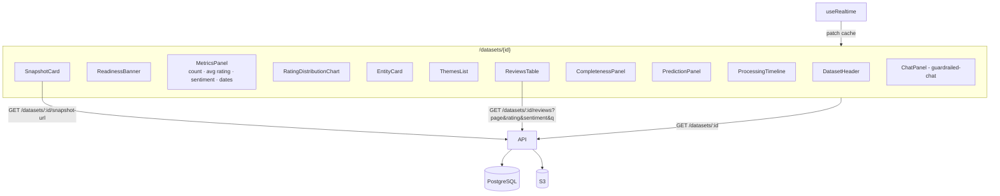

# Design Document

## Overview

The Ingestion Summary is a set of React components at the top of `/datasets/{id}`. It reads from three endpoints: dataset detail (metadata, metrics, `status_detail`), a paginated reviews endpoint (reads `reviews/v{n}.json`), and a pre-signed snapshot URL. Live updates come from the `useRealtime` hook defined in `dataset-library`.

## Architecture

Layout: the header and readiness banner run across the full width. Below them, two columns: on the left, metrics, rating chart, entity, and themes; on the right, snapshot, completeness, and prediction versus actual. After that come collapsible sections for the timeline and the reviews table. The chat panel sits at the bottom of the page. On narrow screens it all stacks into one column.

## Components and Interfaces

### API endpoints

| Method | Path | Response |
|---|---|---|
| GET | `/datasets/{id}` | Full record: metadata, `metrics` (active version), `status_detail` (including `viability` with `predicted` and `actual`), `data_version`, `active_version`, `display_state`, the `dataset_versions` list, `archived_at` |
| GET | `/datasets/{id}/snapshot-url` | `{url, expires_at, version}`: pre-signed URL for the active version's snapshot (or version 1 while it is still processing), valid for 5 minutes; 404 for uploads |
| GET | `/datasets/{id}/reviews?page=1&page_size=25&rating=&sentiment=&q=` | `{items, total, page}`. Reads the `active_version` JSON from S3, keeps it in Lambda memory by `(id, version)`, and filters and paginates on the server |

### Frontend components

- `DatasetHeader`: inline rename (PATCH), original URL link, a "Resolved to" line with expandable redirect hops (including client-side redirects) from `status_detail.redirects`, badges for platform and `display_state`, dates, and "Data as of {completed_at} · v{active_version}".
- `ReadinessBanner`: derives its state from `active_version`, its warnings and review count, and `display_state` for the refreshing and refresh-failed notes (Requirement 4.5).
- `PredictionPanel`: verdict badge, reasons, and warnings next to the actual result; highlights large differences (Requirement 7).
- `MetricsPanel`: stat tiles. A missing value renders "Not available."
- `RatingDistributionChart`: horizontal bars for 5★ down to 1★, with count and percentage labels, readable in both themes. Built with Recharts.
- `EntityCard`: name, category, description, and a "low confidence" chip.
- `ThemesList`: label, mention count, and a sentiment-lean indicator (icon plus text, not color alone).
- `SnapshotCard`: fetches the pre-signed URL, shows the image in a lightbox on click, and shows a placeholder when it fails.
- `CompletenessPanel`: pages captured / MAX_PAGES, extracted versus reported with a percentage bar, extraction method, skipped count, and the warnings list.
- `ProcessingTimeline`: vertical list of `status_detail.events`, newest first, with timestamps in local time.
- `ReviewsTable`: server-paginated, with filters and debounced search.

### Live behavior

When a `dataset.status` event arrives for the current `id`, `useRealtime` patches `['dataset', id]`. When the event's `active_version` differs from the cached one, the page also refetches the detail and invalidates `['reviews', id]` and `['snapshot', id]` so the new version's data loads. While there is no active version, the panels show skeletons and the chat input is disabled. While a refresh runs on a dataset that has an active version, everything stays usable and the banner shows the refreshing note.

## Data Models

No new tables. The page reads `datasets.metrics`, `datasets.status_detail`, `dataset_versions`, and `reviews/v{active_version}.json`, as defined in `review-analysis` and `dataset-ingestion`.

## Correctness Properties

Properties are tested with Hypothesis (backend) and fast-check (frontend).

1. **Paging returns every match once.** *For any* reviews file, filter combination, and page size, concatenating all pages SHALL equal the filtered list, with no duplicates and a stable order. _Validates: Requirements 5.1, 5.2_
2. **Readiness follows the rules.** *For any* active-version metrics and display state, the readiness indicator SHALL match Requirement 4.5. _Validates: Requirement 4.5_
3. **Missing is never zero.** *For any* metrics object with missing fields, the metrics panel SHALL show "Not available" for each missing field and SHALL never show 0 for it. _Validates: Requirement 2.5_
4. **Difference highlight rule.** *For any* verdict and actual result, the prediction panel SHALL highlight exactly the cases defined in Requirement 7.2. _Validates: Requirement 7.2_

## Error Handling

- Dataset not found returns 404, and the UI shows "Dataset not found" with a link back to the Library.
- A reviews JSON file missing for `active_version` while the status is `updated` returns 500 with code `DATA_MISSING`. The UI shows an error and suggests running Refresh.
- An expired pre-signed URL triggers one automatic refetch when the image fails to load.

## Testing Strategy

- **Backend unit tests:** reviews filtering, search, and pagination; the snapshot URL generator (upload returns 404); in-memory cache keyed by version.
- **Backend integration tests:** detail, reviews, and snapshot endpoints against PostgreSQL and LocalStack with seeded fixtures.
- **Frontend component tests:** each component with complete metrics, missing metrics ("Not available"), low-confidence entity, warnings, and upload versus URL datasets; each `ReadinessBanner` threshold plus the refreshing and refresh-failed notes; `PredictionPanel` with a matching and a very different result; a live patch that changes `active_version` and triggers a refetch; a refresh in progress keeping metrics and chat available.
- **Accessibility:** the chart has a text table alternative; sentiment is shown with text as well as color; axe checks run in the component tests.
- **E2E:** open a processed fixture dataset and check that the header, metrics, snapshot, completeness, and a filtered reviews table show the expected values.
