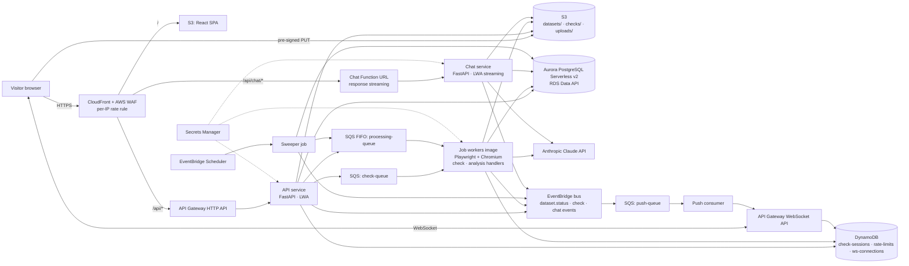

# Design Document

## Overview

This design sets the technical foundation for ReviewLens AI. The brief asks for hosting that is inexpensive, easy to deploy, and able to call AI APIs, and it suggests AWS. It also requires that the backend scale horizontally and move between Lambda and containers without code changes.

The design therefore follows three rules:

1. **Every Service is a stateless container image.** HTTP Services are plain FastAPI apps. Background work is plain queue-message handlers.
2. **Compute is an adapter, not a dependency.** The AWS Lambda Web Adapter runs the HTTP apps on Lambda unchanged. A small consumer runtime runs the same handlers from an SQS event (Lambda) or from a polling loop (container).
3. **All shared state is external:** Aurora (Data API), S3, DynamoDB, SQS, and EventBridge. Any number of instances of any Service can run at once.

The initial deployment is Lambda mode, which costs almost nothing when idle. Container mode (ECS Fargate) is designed for and tested locally, and its CDK stack is an optional task for when load requires it.

The app has no sign-in. Everyone sees the same data. Abuse protection comes from AWS WAF on CloudFront, application rate limits in DynamoDB, a budget alarm, and an Anthropic spend limit.

## Architecture



No Service runs inside a VPC. The database is reached through the RDS Data API over HTTPS, so Services reach Claude and review sites directly with no NAT gateway. The Data API also avoids connection-pool exhaustion when many instances scale out, because it doesn't hold database connections per instance.

### Services and images

| Service | Image | Lambda mode | Container mode |
|---|---|---|---|
| API | `backend` | Lambda + LWA, behind API Gateway HTTP API | ECS service behind an ALB, `uvicorn app.api:app` |
| Chat | `backend` | Lambda + LWA in response-streaming mode, Function URL | Same container as API or its own ECS service, `uvicorn app.chat:app` |
| Job workers (check + analysis) | `workers` (backend + Playwright/Chromium) | Lambda with SQS event-source mappings, one function per queue | ECS service running `python -m app.consumer --queue check` / `--queue processing`, autoscaled on queue depth |
| Push consumer | `backend` | Lambda with SQS event source | ECS service `python -m app.consumer --queue push` |
| Sweeper | `backend` | Lambda invoked by EventBridge Scheduler every 5 minutes | ECS scheduled task `python -m app.jobs.sweep` |

The Capture module (headless Chromium) runs in-process inside the job workers. It isn't a separate Service, so there is no internal HTTP hop and no extra auth to manage.

### Technology choices

| Concern | Choice | Rationale |
|---|---|---|
| Frontend | React + TypeScript + Vite, served from S3 through CloudFront | Static, cheap, fast from the CDN |
| HTTP services | Python 3.12, FastAPI, run on Lambda through the **AWS Lambda Web Adapter** | The same image runs as a normal HTTP server in a container; LWA also enables response streaming on Lambda |
| Queue consumers | `app.consumer` runtime: an SQS event adapter for Lambda and a long-poll loop for containers, both calling the same `handle(message)` | One code path for both compute modes |
| URL checks | SQS standard `check-queue`, one message per URL | Portable (containers can't receive Lambda async invokes); retries and DLQ come built in |
| Dataset processing | **SQS FIFO** `processing-queue` (message group = dataset ID, dedup ID = `dataset_id:version`) with DLQ | One message per dataset at a time, across any number of worker instances |
| Real-time push | EventBridge → SQS `push-queue` → push consumer → API Gateway WebSocket API; connection IDs in DynamoDB | Every async path is a queue consumer, so it scales the same way |
| Relational store | **Aurora PostgreSQL Serverless v2** (minimum 0 ACU, auto-pause) through the **RDS Data API**; plain PostgreSQL 16 in Docker for local and CI | No VPC or NAT gateway, no connection pool to exhaust, near-zero idle cost. The first request after an auto-pause takes about 15 seconds while the database resumes |
| Object store | S3, private, SSE-S3 | Required by the brief |
| Shared counters and short-lived state | DynamoDB (on-demand) | Rate limits, check sessions, and WebSocket connections are shared across instances |
| Edge protection | CloudFront + AWS WAF with a rate-based rule per IP and AWS managed common rules; CloudFront adds a secret `X-Origin-Verify` header that the Services require | Open app with no sign-in; stops direct calls that bypass the WAF |
| AI | Anthropic Claude through the official Python SDK; model IDs set by config (a larger model for chat, a smaller one for page reading and classification) | Strong instruction-following for the scope guard; prompt caching fits whole-dataset context |
| Infrastructure as code | AWS CDK (TypeScript) with a `computeMode` context value per Service (`lambda` now; `container` later) | One `cdk deploy`; the switch is in infrastructure only |
| CI/CD | GitHub Actions with OIDC into AWS; images built once and pushed to ECR by digest | The same image digest is tested in containers and deployed to Lambda |
| Migrations | Alembic, run as a one-off task before each deploy | Versioned schema changes |

## Components and Interfaces

### Repository layout

```
/infra            CDK app (stacks: Data, Edge, Api, Workers, Realtime, Frontend, Cost, TestFixtures; optional Containers)
/backend
  Dockerfile              backend image (API, chat, push, sweeper)
  Dockerfile.workers      workers image (adds Playwright + Chromium)
  /app
    api.py        FastAPI app for the API service
    chat.py       FastAPI app for the chat service
    consumer.py   queue consumer runtime (Lambda SQS adapter + long-poll loop)
    /handlers     check, processing, push message handlers
    /jobs         sweep
    /core         config, logging, db, rate_limit, origin_guard, errors, health
    /db           SQLAlchemy models, Alembic migrations
    /storage      S3 helpers and key builders
    /events       EventBridge publisher
    /capture      Playwright capture (used in-process by workers)
    /extraction   page cleaning, AI review locator, extraction plans (review-extraction)
  /tests          unit/, integration/, scale/
/frontend
  /src            React app
  /tests          unit (Vitest + Testing Library)
/e2e              Playwright end-to-end tests
/fixtures-site    static review pages deployed to a public test site
/evals            extraction and guardrail evaluation suites
docker-compose.yml  every Service as a container + PostgreSQL + LocalStack + fixtures
.github/workflows ci.yml, deploy.yml, evals.yml
```

### Shared backend modules

- `core.config.Settings`: Pydantic settings from environment variables and Secrets Manager. Fields include:
  - Crawl and data limits: `MAX_PAGES` (10), `MAX_REVIEWS` (1000), `MAX_URLS_PER_CHECK` (10), `CHECK_TIMEOUT_S` (60), `MAX_UPLOAD_MB` (10)
  - Viability: `VIABILITY_MIN_REVIEWS` (5)
  - Extraction: `EXTRACTION_STRATEGY` (`auto`), `EXTRACT_PAGE_TOKEN_BUDGET` (30000), `SELECTOR_MIN_AGREEMENT` (0.8)
  - AI: `CLAUDE_CHAT_MODEL`, `CLAUDE_EXTRACT_MODEL`, `CLAUDE_PRECHECK_MODEL`, `CHAT_CORPUS_TOKEN_BUDGET` (150000)
  - URL handling: `TRACKING_PARAMS`
  - Rate limits: `RL_CHECKS_PER_IP_HOUR` (30), `RL_QUESTIONS_PER_IP_HOUR` (120), `RL_GLOBAL_AI_CALLS_PER_HOUR` (2000)
  - Sweeper: `SWEEP_REQUESTED_AFTER_MIN` (5), `SWEEP_PROCESSING_STALE_MIN` (20)
  - Environment: `SERVICE_NAME`, `ENV`, `ORIGIN_VERIFY_SECRET`, `SSRF_TEST_ALLOW_HOSTS` (empty; startup fails if set when `ENV=production`), `S3_BUCKET`, queue URLs, and the database connection (Data API ARNs in AWS, `DATABASE_URL` locally)
- `core.db`: one SQLAlchemy engine factory. It uses the `sqlalchemy-aurora-data-api` driver in AWS and `psycopg` locally, so the rest of the code doesn't care which is in use.
- `core.origin_guard`: FastAPI middleware that rejects requests without the correct `X-Origin-Verify` header (skipped for `/healthz` and `/readyz`, and in local development).
- `core.rate_limit`: fixed-window counters in DynamoDB (`rate-limits`, TTL), keyed by action and by `sha256(client_ip)` or `global`. The client IP comes from CloudFront's `CloudFront-Viewer-Address` header. Exceeding a limit returns 429 with `Retry-After`.
- `core.logging`: JSON logger to stdout with `service`, `instance_id`, `correlation_id`, and `dataset_id` from context variables.
- `core.health`: `/healthz` (process alive) and `/readyz` (config loaded, database and S3 reachable).
- `storage.keys`: the only place that builds S3 keys (see Data Models).
- `db.status.transition(dataset_id, new_status, message, extra=None)`: updates `status` and appends to `status_detail` in one transaction, then publishes `dataset.status.changed`. Every status change goes through this function. `db.status.log_event()` appends a progress event without changing status.

### Queue consumer runtime (`app.consumer`)

```python
class Handler(Protocol):
    queue: str                                  # "check" | "processing" | "push"
    def handle(self, body: dict, meta: MessageMeta) -> None: ...   # idempotent

def lambda_entry(event, context): ...   # SQS event → handler, partial batch failures reported
def run_poller(queue: str): ...         # long-poll loop for containers
```

- **Lambda mode:** SQS event-source mapping calls `lambda_entry`, which reports failed message IDs through `batchItemFailures`.
- **Container mode:** `run_poller` long-polls (20 s), extends visibility while a handler is working (heartbeat every 30 s), deletes the message on success, and stops taking new messages on `SIGTERM`, finishing the current one within the ECS stop timeout.
- `MessageMeta` carries the receive count, so handlers can detect the final attempt the same way in both modes.

### Horizontal-scaling rules applied throughout

| Concern | Rule |
|---|---|
| Duplicate or concurrent messages | Every handler is idempotent. Processing uses FIFO groups per dataset. Check items use a conditional DynamoDB update (`state = pending → checking`) so only one instance works on an item |
| Races on creation | Unique indexes in Aurora (normalized URL), conditional writes in DynamoDB |
| Scheduled jobs | The sweeper claims rows with `SELECT … FOR UPDATE SKIP LOCKED` inside a transaction, so several sweeper instances never act on the same row |
| Caches | Only immutable data (a data version's review corpus) is cached in memory, keyed by `(dataset_id, version)` |
| Local disk | Only `/tmp` for Chromium scratch files, cleared per message |
| Configuration | Environment variables and Secrets Manager only |
| Logs | stdout JSON; CloudWatch in both modes |

## Data Models

### `datasets` table

| Column | Type | Notes |
|---|---|---|
| `id` | UUID PK | Generated by the server |
| `name` | text | Page title by default; editable |
| `page_title` | text null | From the captured page's `<title>` |
| `source_type` | enum(`url`,`upload`) | |
| `original_url` | text null | URL as entered; shown as the main URL |
| `final_url` | text null | URL after redirects that returned 200 |
| `normalized_url` | text null | Canonical form of `original_url`; unique for URL datasets (see dataset-ingestion) |
| `normalized_final_url` | text null | Canonical form of `final_url`; indexed |
| `platform` | text null | Host-derived label, for example `trustpilot.com`, or `csv` |
| `status` | enum(`requested`,`processing`,`updated`,`failed`) | |
| `status_detail` | JSONB | `{"events":[{"status","at","message","data"}], "redirects":[...], "viability":{...}}` |
| `requested_at` | timestamptz | |
| `updated_at` | timestamptz | Last update date (see note below) |
| `archived_at` | timestamptz null | Soft archive |
| `metrics` | JSONB null | Written by review-analysis, for the active version only |
| `data_version` | int | Goes up on each refresh (latest version attempted) |
| `active_version` | int null | Latest version that finished `updated`; read by the summary and chat (see review-analysis) |

`updated_at` is set to the request time when the row is inserted, as the brief asks for a "last update date" on the new record. It is set again whenever processing completes.

Indexes: `(archived_at, updated_at desc)`; a unique partial index on `normalized_url` where `source_type = 'url'`; an index on `normalized_final_url`; an index on `(status, updated_at)` for the sweeper.

### `dataset_versions` table

One row per data version: `(dataset_id, version)` PK, `trigger`, `requested_at`, `completed_at`, `review_count`, `extraction_method`, `outcome`. Columns are detailed in `dataset-ingestion`. It is written by the Refresh Service and ingestion, completed by review-analysis, and read by the Library and the chat refresh markers.

### S3 key layout (`storage.keys`)

```
checks/{check_id}/{item_id}/page.html     temporary Check capture (deleted after 1 day)
checks/{check_id}/{item_id}/snapshot.png  temporary Check screenshot
checks/{check_id}/{item_id}/plan.json     temporary extraction plan from the Check
uploads/{upload_id}/file                  pending upload via pre-signed PUT (deleted after 1 day)
datasets/{id}/raw/v{n}/page-{k}.html      captured HTML per page
datasets/{id}/raw/v{n}/plan.json          extraction plan used for this version
datasets/{id}/raw/v{n}/upload.csv         uploaded file (upload datasets)
datasets/{id}/raw/v{n}/mapping.json       column mapping for upload datasets
datasets/{id}/snapshot/v{n}.png           above-the-fold screenshot
datasets/{id}/reviews/v{n}.json           normalized reviews + entity profile
datasets/{id}/chat/{iso_ts}-{uuid}.json   one object per Q&A exchange
```

### Event schemas

All three are broadcast to every connected browser. The app has no users, so there's nothing to scope them to; each browser ignores events for checks or datasets it isn't displaying.

`dataset.status.changed`:

```json
{ "dataset_id": "uuid", "status": "processing", "at": "ISO-8601",
  "data_version": 3, "active_version": 2,
  "message": "Fetching page 3 of 10", "metrics": { } }
```

`check.updated`:

```json
{ "check_id": "uuid", "item_id": "u1", "state": "done",
  "verdict": { }, "existing_dataset": { } }
```

`chat.exchange.saved` (so everyone viewing a dataset sees new Q&A live):

```json
{ "dataset_id": "uuid", "exchange_id": "uuid", "data_version": 2, "asked_at": "ISO" }
```

## Correctness Properties

Properties are tested with Hypothesis (backend).

1. **Rate limits hold.** *For any* sequence of requests from any mix of client IPs within one window, the number allowed per IP SHALL NOT exceed the per-IP limit, and the total allowed SHALL NOT exceed the global limit. _Validates: Requirement 2.4_
2. **No raw client IPs stored.** *For any* request, every rate-limit key, log line, and stored record SHALL contain only the hashed IP, never the raw IP. _Validates: Requirement 2.5_
3. **Origin guard.** *For any* request whose `X-Origin-Verify` header is missing or differs from the secret, every non-health endpoint SHALL refuse it. _Validates: Requirement 2.3_
4. **Batch failure reporting.** *For any* batch of SQS messages and any pattern of handler successes and failures, the Lambda adapter SHALL report exactly the failed message IDs, and the poller SHALL delete exactly the succeeded messages. _Validates: Requirements 3.4, 3.5_
5. **Status history is append-only.** *For any* sequence of `transition()` and `log_event()` calls, `status_detail.events` SHALL be in time order, earlier events SHALL be unchanged, and the last status event SHALL equal the `status` column. _Validates: Requirement 4.4_
6. **Keys stay in their prefix.** *For any* dataset ID, version, and page number, every permanent key SHALL start with `datasets/{id}/`, and different artifacts SHALL never produce the same key. _Validates: Requirement 5.1_

## Error Handling

- API errors return `{ "error": { "code": "...", "message": "..." } }` with the correct HTTP status. Stack traces appear only in logs.
- Queue failures: SQS retries up to 3 times, then moves the message to a DLQ. On the final attempt (from `MessageMeta.receive_count`), handlers record a user-safe failure. A DLQ consumer also marks affected datasets `failed`, as a backstop for Lambda hard timeouts. SQS visibility timeouts are 6× the Lambda timeout, and in container mode the poller's heartbeat keeps messages invisible while they are being worked on.
- A missing secret or configuration value stops startup with a clear log message, and `/readyz` reports not ready.
- Abuse and cost protection: WAF rate-based rule (default 300 requests per 5 minutes per IP), application rate limits per IP and globally, an AWS Budgets alarm, and a spend limit in the Anthropic console.

## Testing Strategy

- **Backend unit tests (pytest):** config parsing (including the production allowlist refusal); key builders; the status transition function; the origin guard; rate-limit windows (per IP and global); the consumer runtime (Lambda batch failures, poller heartbeat, `SIGTERM` handling) with moto.
- **Backend integration tests (pytest):** `docker-compose` runs PostgreSQL, LocalStack (S3, SQS, DynamoDB, EventBridge), the fixtures container, and every Service **as a container**. Tests call the API over HTTP and observe queues, S3, and the database.
- **Scale test:** two instances of each queue consumer and two sweeper runs against the same queues; asserts no duplicate datasets, versions, check results, or Exchanges, and that FIFO processing never overlaps for one dataset.
- **Frontend unit tests (Vitest + Testing Library).**
- **End-to-end tests (Playwright):** against a deployed stack (Lambda mode) or local `docker-compose` (container mode), with the Claude client replaced by a recorded-fixture stub unless `E2E_LIVE_AI=1`.
- **Fixture review pages:** SSRF protection blocks private addresses, so fixture pages served from `localhost` would always be refused. Deployed stacks point tests at `/fixtures-site`, published to a separate public S3 + CloudFront test site. Local runs set `SSRF_TEST_ALLOW_HOSTS=fixtures` for the compose fixture container. Production refuses to start with that setting.
- **Data API parity:** integration tests run on plain PostgreSQL. A post-deploy smoke test runs reads and writes through the Data API driver to catch driver differences.
- **CI:** lint (ruff, eslint), type checks (mypy, tsc), unit tests, image build, container integration tests, scale test, then `cdk synth`. Deploy runs only on `main` after every earlier step passes, and deploys the tested image digests. Coverage goes to the job summary.

## Known Issues

### Status event timestamps can be out of order under concurrency — Property 5 gap

Found 2026-10-04 by the scale test
(`tests/scale/test_concurrency_invariants.py::test_concurrent_status_writes_are_lossless_and_ordered`).
Correctness Property 5 states `status_detail.events` "SHALL be in time order".
Under concurrent `log_event`/`transition` on one dataset, the stored events are
LOSSLESS and never reshuffled (the `jsonb ||` append under `SELECT ... FOR
UPDATE` serialises correctly, and the scale test confirms no event is lost), but
their `at` timestamps can be slightly out of order (observed: an ~8 ms
inversion). Root cause: `app/db/status.py::_build_event` stamps `at` (via
`_utc_now_iso()`) in Python BEFORE `_append_event` acquires the row lock, so
thread A can compute an earlier `at` yet win the lock after thread B — the array
is ordered by commit/append, not by `at`. So append order is correct but `at`
monotonicity is not guaranteed, which the literal Property 5 wording and the
scale test require.

Severity: low (a few-ms inversion in a progress log; no data loss, no reorder of
the array, last-status-event-equals-column still holds). But it does violate the
stated property. NOT caused by this session's refresh/keep-rule fixes — it is in
the original `_append_event` design.

Fix direction (platform-foundation, `app/db/status.py`): assign `at` INSIDE the
lock at append time so timestamp order always matches append order — e.g. stamp
`at` within `_append_event` (or in the same `UPDATE` via `now()`) rather than in
`_build_event` before the lock. Keep the event shape and the
last-status-event-equals-column invariant. Then
`test_concurrent_status_writes_are_lossless_and_ordered` passes. Alternatively,
if "time order" is meant as "append order preserved" rather than "at
monotonic", relax the property wording and the test assertion — but assigning
`at` under the lock is the smaller, more honest fix and keeps the property as
written.

### Aurora engine version `16.4` was removed and blocks the Data stack deploy

Found during the first live `cdk deploy ReviewLens-Data` (platform-foundation
task 7.2 bootstrap). `infra/lib/data-stack.ts` pinned the Aurora PostgreSQL
cluster to `AuroraPostgresEngineVersion.VER_16_4`. AWS has since removed the
plain `16.4` minor from `aurora-postgresql` availability (only `16.4-limitless`,
a different offering, remains), so cluster creation failed with
`Cannot find version 16.4 for aurora-postgresql` (RDS, 400 InvalidRequest) and
CloudFormation rolled the stack back.

`aws rds describe-db-engine-versions --engine aurora-postgresql` in us-east-1 at
deploy time listed the available standard 16.x minors as 16.8, 16.9, 16.10,
16.11, 16.13, 16.14, 16.15 (plus `*-limitless` variants). The product intent is
unchanged: Aurora PostgreSQL 16, Serverless v2, Data API.

Fix (platform-foundation, `infra/lib/data-stack.ts`): pin to `VER_16_8` — the
lowest still-available standard 16.x, the most conservative jump from the
intended 16.4. No test asserts the version string, so CDK synth/assertion tests
are unaffected. Note AWS deprecates specific minors over time; a future deploy
may need another bump, so prefer the lowest available in-support 16.x rather
than chasing the newest.

Severity: release-blocking for the first deploy (the Data stack is the root of
every other stack), trivial fix. The rolled-back first attempt also left three
Retain-policy DynamoDB tables (`check-sessions`, `rate-limits`,
`ws-connections`) orphaned, which then blocked the retry with "already exists";
they were empty, seconds-old, and deleted before re-deploying.

### `workflow_run`-triggered deploy can't assume the OIDC role — subject mismatch

Found by the first automated deploy (CI passed, Deploy failed at "Configure AWS
credentials (OIDC)" with `Not authorized to perform
sts:AssumeRoleWithWebIdentity`). The deploy role ARN, the OIDC provider, and the
`aud` condition (`sts.amazonaws.com`) all matched; only the `sub` condition
rejected the token.

Root cause: `deploy.yml` is triggered by `workflow_run` (it waits for the CI
workflow to finish), not by a direct `push`. The GithubOidc trust policy
allowed `sub` of `repo:danjger/ReviewLens-AI:ref:refs/heads/main` and
`...:environment:*`, but a `workflow_run`-triggered job does not present the
`ref:refs/heads/main` subject, so neither allowed pattern matched.

Fix (no IAM change): gate the deploy job on a GitHub Environment
(`environment: production` in `deploy.yml`) and create that environment in the
repo. GitHub then issues the token with
`sub = repo:danjger/ReviewLens-AI:environment:production`, which the trust
policy ALREADY allows via its `repo:OWNER/REPO:environment:*` entry. This keeps
the trust least-privilege and unchanged, and gives a natural home for deploy
protection rules later. (Alternative considered and rejected: widen the trust
policy to a repo-scoped `sub` wildcard — looser than necessary when the
environment subject is already trusted.)

Severity: release-blocking for the automated deploy; config-only fix in
`deploy.yml` + a one-time `gh api PUT .../environments/production`.

UPDATE (same session, after live debug): the environment gating alone did NOT
fix it — a second deploy still failed at the OIDC step. A temporary debug step
in `deploy.yml` printed the real token subject:
`repo:danjger@984525/ReviewLens-AI@1398576857:environment:production`. The true
root cause is GitHub's immutable subject claims: repos created/renamed/
transferred after mid-2026 embed immutable numeric owner and repo IDs
(`owner@<id>/repo@<id>`) in `sub`, so even the `environment:production` form did
not match the name-only `repo:danjger/ReviewLens-AI:environment:*` pattern.
Final fix: broaden the trust `sub` patterns to `repo:danjger*/ReviewLens-AI*:...`
(the `*` covers the optional `@<id>` suffix on owner and repo while keeping the
trust scoped to this owner+repo). Applied to the live role via
`iam update-assume-role-policy` and to `infra/lib/github-oidc-stack.ts` so a
future `cdk deploy ReviewLens-GithubOidc` reproduces it. The environment gating
is kept — it makes the subject deterministic and a place for protection rules.

### Deploy can't cross-build the arm64 Lambda/ECS images on the x86 runner

Found by the first CDK deploy step to run (after the OIDC trust was fixed).
`CDK deploy (Lambda mode)` failed building the API image asset with
`exec /bin/sh: exec format error` during `docker build ... --platform
linux/arm64`. All Lambdas and ECS tasks target arm64/Graviton
(`lambda.Architecture.ARM_64`, `ecs.CpuArchitecture.ARM64`), so CDK builds the
image assets for linux/arm64 — but the `ubuntu-latest` runner is x86_64 and the
deploy workflow set up Buildx without QEMU, so the arm64 build layers (e.g.
`dnf install`) couldn't execute.

Fix: add `docker/setup-qemu-action@v3` (platforms: arm64) before
`setup-buildx-action` in `deploy.yml` so binfmt/QEMU emulation is registered and
the arm64 asset build runs under emulation. CI's `build-images` job was
unaffected because it builds the images natively (no `--platform arm64`) just to
validate and feed the container integration/scale tests; only the CDK asset
build pins arm64.

### DLQ event-source mapping rejected — DLQ visibility timeout < Lambda timeout

Found by the first deploy that reached `ReviewLens-Workers` (images built, Data
and Api stacks up). All three DLQ→DLQ-consumer `AWS::Lambda::EventSourceMapping`
resources failed with: `Queue visibility timeout: 30 seconds is less than
Function timeout: 300 seconds`, and the stack rolled back. AWS requires an SQS
queue feeding a Lambda event source to have `visibilityTimeout >= the function
timeout`. The MAIN queues set `visibilityTimeout = 6x worker timeout`, but the
three DLQs (`CheckDlq`, `ProcessingDlq`, `PushDlq`) were created WITHOUT a
visibility timeout, so they defaulted to 30s while the DLQ consumer Lambda has a
300s timeout. CDK synth tests passed because this is a runtime AWS validation,
not a synth-time one.

Fix: set `visibilityTimeout: workerVisibility` on the three DLQs in
`api-stack.ts` (and the same on `containers-stack.ts` for parity, where the DLQs
feed ECS pollers rather than a Lambda event source — AWS does not enforce the
rule there, but matching avoids mid-flight redelivery). The rolled-back
`ReviewLens-Workers` stack (terminal `ROLLBACK_COMPLETE` from a failed initial
create) was deleted so the next deploy recreates it cleanly.

### Migration step fails on Aurora Serverless v2 auto-pause cold start

Found by the first deploy to reach the migration step (all six stacks deployed
successfully first). `alembic upgrade head` failed immediately with
`DatabaseResumingException: The Aurora DB instance ... is resuming after being
auto-paused. Please wait a few seconds and try again.` The Data stack sets
`serverlessV2MinCapacity: 0`, so the cluster auto-pauses when idle; during the
~20-min deploy it scaled to zero, and the migration's first Data API call hit it
mid-resume. This is expected cold-start behaviour, not a defect.

Fix: wrap the `alembic upgrade head` call in `deploy.yml` in a bash `until`
retry (up to 12 attempts, 10s apart) so a cold start waits for the cluster to
wake instead of failing the deploy. The migration also warms the cluster for the
later smoke test. (Pure bash retry chosen over a Python/boto3 pre-check to avoid
a heredoc-indentation hazard inside the YAML block scalar.)

### /readyz reports "not ready" in AWS (Data API) mode — false negative

Found by the post-deploy smoke test (the LAST deploy step; everything else —
all six stacks, migrations, SPA upload + CloudFront invalidation — succeeded).
`/healthz` returned 200 and the Data API read/write round-trip passed, but
`/readyz` returned 503 `{"status":"not ready","reason":"DATABASE_URL not
configured"}`. Root cause: `app/core/health._check_database` assumed a
`DATABASE_URL` psycopg connection, but in AWS mode (`settings.is_aws`, i.e.
`DB_RESOURCE_ARN` + `DB_SECRET_ARN` set) the DB is reached through the RDS Data
API and `DATABASE_URL` is intentionally unset — so the probe always failed on
Lambda even though the database was reachable.

Fix: make `_check_database` mode-aware. In AWS mode run `SELECT 1` via the
shared SQLAlchemy engine (`app.core.db.get_engine()`), the same Data API path
the app uses; otherwise keep the psycopg `DATABASE_URL` probe. Public
`readiness()` signature unchanged, so both the API and chat services get the fix
without touching their call sites. Added unit tests for both AWS-mode branches
(healthy engine, and engine failure → unreachable).

### Scale/integration CI flake: consumer polls an SQS queue before it exists

The CI scale test (and intermittently integration) failed non-deterministically
(~3 of 6 runs) during `docker compose up -d --wait`, before pytest ran:
`push-consumer` exited (1) with `QueueDoesNotExist ... The specified queue does
not exist` on its first `ReceiveMessage`. Root cause: consumers wait for
`localstack: service_healthy`, but LocalStack's healthcheck only grepped the
`/_localstack/health` "running" state, which flips true BEFORE the init script
(`infra/localstack-init/01-provision.sh`, mounted at ready.d) finishes creating
the queues/tables/bus. So a consumer could start and poll a not-yet-created
queue and crash, failing `up --wait`.

Fix (compose/test-harness only): the init script writes a `/tmp/localstack-ready`
sentinel as its last step, and the LocalStack healthcheck requires both
"running" AND that sentinel. `service_healthy` now means "provisioning
complete", so no consumer starts early. Verified: `make test-scale` from a fresh
volume brings every container up Healthy with push-consumer RestartCount 0 and
exits 0. No runtime consumer code changed (a bounded startup retry in the
consumer is a possible future hardening for production, where a missing queue is
a real error rather than a startup-ordering artifact).

### Runtime 500s on Aurora auto-pause cold start (not just migrations)

Found by the live end-to-end check: `GET /api/datasets` returned 500 after the
stack had been idle. CloudWatch showed `DatabaseResumingException ... resuming
after being auto-paused` raised at the aurora-data-api `BeginTransaction`, i.e.
the SAME auto-pause cold start as the migration step — but now in the running
app. With `serverlessV2MinCapacity: 0`, every first request after an idle period
hits a resuming cluster, so an analyst opening the portal after a quiet spell
would get a 500 (confirmed: a retry ~15s later returned `200 {"datasets":[]}`).
`/readyz` masked it because the health probe's `SELECT 1` is itself what warms
the cluster.

Fix (data layer, covers API + chat + workers): in `app/core/db`, register an
`engine_connect` warm-up (AWS mode only) that runs `SELECT 1` on each new
connection and retries on `DatabaseResumingException` (bounded: 12 × 5s) before
any application statement runs. Only the connection warm-up is retried — never
business logic — so there is no double-write risk. Non-resume errors propagate
immediately. The deploy's migration bash-retry (task 23) is kept as a belt-and-
braces for the one-off migration context.

### All worker Lambdas crash: Runtime.InvalidEntrypoint (web adapter vs RIC)

Found by the live end-to-end run: a submitted Check stayed `pending` forever.
CloudWatch showed EVERY worker Lambda (check, processing, push, dlq, sweeper)
failing at init with `Runtime.InvalidEntrypoint`. The HTTP tier (api/chat) was
healthy, so the control plane worked but the entire background pipeline was
dead. The smoke test missed it because it only probes HTTP + a direct Data API
round-trip, never a queue consumer.

Root cause: both container images bake in the AWS Lambda Web Adapter
(`AWS_LAMBDA_EXEC_WRAPPER=/opt/extensions/lambda-adapter`), which is correct for
the HTTP services (uvicorn behind LWA). But the worker functions are configured
with `cmd=["app.consumer.lambda_entry"]` — a native Lambda handler path for an
SQS event source (exactly as `app/consumer.py` documents). LWA can't dispatch a
dotted-path handler; it expects to front an HTTP server. So Lambda could not
start the container → InvalidEntrypoint on every invoke.

Fix (keep one image per the "same code, both modes" rule): add the Lambda
Runtime Interface Client (`awslambdaric`) to the runtime deps, and in CDK give
the five worker functions `entrypoint=["/var/task/.venv/bin/python","-m",
"awslambdaric"]` plus `AWS_LAMBDA_EXEC_WRAPPER=""` so they run under the RIC
(dispatching SQS events to `lambda_entry`) instead of LWA. api/chat are
untouched and keep LWA. Container mode (`python -m app.consumer --queue ...`) is
unaffected (Compose/ECS override the command). Verified in the synthesized
template: all five functions now carry the RIC EntryPoint, the correct Command,
and a blank exec wrapper. Needs a rebuild + redeploy to take effect.

UPDATE (same session): after switching to the RIC the workers stopped crashing
with InvalidEntrypoint but then hit `INIT_REPORT ... Status: timeout` (~10s init
cap). Cause: the Lambda Web Adapter was COPIED into `/opt/extensions/` in the
images, and anything under `/opt/extensions/` loads as a Lambda extension at
init regardless of `AWS_LAMBDA_EXEC_WRAPPER` — so LWA still ran and ate init
time on the heavy (Playwright/Chromium) image. Fix: remove the LWA COPY from
`Dockerfile.workers` entirely and build ALL five worker Lambdas from that
LWA-free image (push/dlq/sweeper switched from the base `Dockerfile` to
`Dockerfile.workers`). api/chat keep the base image with LWA. Handler modules
already import lazily (`_load_handler`), so RIC init only imports the light
`app.consumer`, keeping cold start under the init cap.
