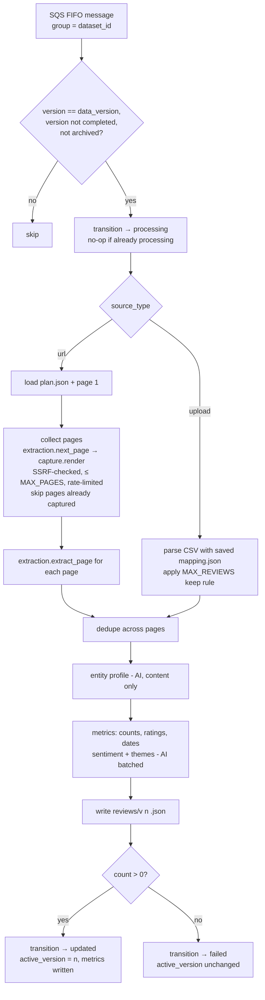

# Design Document

## Overview

The processing handler consumes `processing-queue` messages and runs a pipeline of stages:
**start → collect pages → extract → dedupe → profile → metrics → complete**.
Each stage writes a progress event through `db.status.transition()` or `db.status.log_event()`, and both publish to EventBridge. Page reading is delegated to the Extraction Engine (`app.extraction`, from `review-extraction`). The Check already built an Extraction Plan for the first page, so the Worker starts with a known method and next-page rule and only calls the AI where needed. Other AI calls go through the instrumented Claude client from `platform-foundation`.

> **Page limit (from the brief's "how many pages is the max?"):** `MAX_PAGES=10` and `MAX_REVIEWS=1000` by default. At about 10–25 reviews per page, a scraped dataset holds roughly 100–250 reviews. Uploads can reach the 1,000 cap. At roughly 100–150 tokens per review, 1,000 reviews is about 100k–150k tokens, which still fits in one Claude context for chat (see guardrailed-chat for the budget rule). Both limits are configurable.

> **Scraping caveat:** Amazon and Google Maps actively block automated access and restrict scraping in their terms. The AI-first engine handles any public review page it can load; pages behind bot protection get a `wont_work` verdict at Check time, and CSV upload covers those sources.

## Architecture



The Worker is triggered by an **SQS FIFO** queue with message group ID = dataset ID and deduplication ID = `dataset_id:version`. FIFO delivers one message per dataset at a time across every Worker instance, so retries run in sequence and two instances never process the same dataset at once. Messages for different datasets run in parallel, so adding instances adds throughput.

The start guard treats `processing` for the same version as a retry and continues. Without this, the first failed attempt would set `processing` and every retry would then be skipped.

The sweeper runs every 5 minutes (EventBridge Scheduler → Lambda, or an ECS scheduled task). It claims rows with `SELECT … FOR UPDATE SKIP LOCKED`, so several sweeper runs never act on the same row. It:

- re-enqueues rows that have been `requested` for more than 5 minutes;
- marks rows `failed` that have been `processing` with no new `status_detail` event for more than 20 minutes (for example after a Lambda hard timeout), completing their `dataset_versions` row with outcome `failed`.

A DLQ consumer does the same `failed` transition for messages that exhaust their retries.

## Components and Interfaces

### Pipeline (`handlers/processing.py`)

`ProcessingHandler.handle({dataset_id, version}, meta)` runs the stages in order. Each stage is a pure function over data held in S3, which makes it easy to unit test and to rerun idempotently. Output keys include the version, so a rerun overwrites that version's objects. Pages are written to `raw/v{n}/page-{k}.html` before extraction starts, and collection skips any `k` that already exists, so a retry after a crash reuses captured pages.

Collection loop (URL datasets):

```python
html, url = load_page(1)
for k in range(2, MAX_PAGES + 1):
    nxt = extraction.next_page(html, url, plan)
    if not nxt.url: warn_if(nxt.reason_if_none); break
    assert_public_host(nxt.url)                     # from dataset-ingestion
    html, url = existing_or_capture(k, nxt.url)     # capture.render, per-host delay
    log_event(f"Captured page {k} of up to {MAX_PAGES}")
    if running_review_estimate() >= MAX_REVIEWS: break
```

Extraction calls `extraction.extract_page(html, url, plan, is_last=(k == last))` for each page and collects the `PageResult` details.

### Other AI tasks (`worker/ai/`)

All prompts include a strict instruction: *use only the provided content; do not add outside knowledge*. Outputs are requested as JSON that matches a Pydantic schema, which is validated on return.

| Task | Input | Output | Notes |
|---|---|---|---|
| `entity_profile` | Page title, page header text, plan `entity_hint`, first 30 reviews | `{name, category, description, confidence}` | |
| `classify_sentiment` | Batches of 50 reviews | `[{id, sentiment}]` | Rating used as a hint, not the final answer |
| `extract_themes` | All review texts, truncated if over budget | `[{label, mentions, lean, example_ids}]` (≤ 8) | `example_ids` must exist in the corpus |

## Data Models

### `reviews/v{n}.json`

```json
{
  "dataset_id": "uuid", "version": 1, "generated_at": "ISO",
  "entity": { "name": "Acme CRM", "category": "CRM software",
              "description": "...", "confidence": "high" },
  "pages": [ { "page": 1, "url": "…", "method": "selectors", "found": 24, "fallback": false, "discarded": 0 } ],
  "reviews": [
    { "id": "r_0001", "text": "...", "rating": 4, "date": "2026-07-01",
      "author": "J. D.", "title": "...", "sentiment": "positive", "source_page": 1 }
  ]
}
```

### `metrics` (JSONB)

```json
{
  "review_count": 212, "reported_total": 1540, "pages_captured": 10,
  "skipped": 3, "avg_rating": 3.8,
  "rating_distribution": { "1": 20, "2": 14, "3": 30, "4": 70, "5": 78 },
  "date_range": { "min": "2024-02-01", "max": "2026-09-20" },
  "sentiment": { "positive": 120, "neutral": 40, "negative": 52 },
  "themes": [ { "label": "Customer support", "mentions": 44, "lean": "negative" } ],
  "extraction": { "method": "selectors", "pages_by_selectors": 9, "pages_by_ai": 1,
                  "locator_discarded": 2, "structured_agreement": 0.95 },
  "warnings": [], "duration_ms": 48210
}
```

## Correctness Properties

Properties are tested with Hypothesis against the pipeline stages, using generated review sets and a stubbed Extraction Engine.

1. **Dedupe is idempotent and complete.** *For any* list of reviews, deduping twice SHALL equal deduping once, and the result SHALL contain no two reviews with the same normalized text, author, and date. _Validates: Requirement 3.3_
2. **Review cap.** *For any* upload and any page sequence, the stored review count SHALL never exceed MAX_REVIEWS. _Validates: Requirements 2.1, 3.4_
3. **Metrics agree with data.** *For any* review set, `review_count` SHALL equal the number of stored reviews, the rating distribution SHALL sum to the number of rated reviews, and the sentiment breakdown SHALL sum to `review_count`. _Validates: Requirements 5.1, 5.2_
4. **Active version only moves forward on success.** *For any* sequence of successful and failed versions, `active_version` SHALL equal the highest version whose outcome is `updated`. _Validates: Requirements 6.1, 6.5_
5. **Reprocessing is idempotent.** *For any* dataset version, running the pipeline twice SHALL produce identical stored outputs and one `dataset_versions` completion. _Validates: Requirement 7.3_
6. **Start guard.** *For any* combination of message version, dataset status, data version, completion state, and archive flag, the guard SHALL proceed exactly in the cases listed in Requirement 1.2. _Validates: Requirement 1.2_

## Error Handling

- **Versions and failed refreshes:** `datasets.data_version` is the latest version attempted. `datasets.active_version` is the latest version that finished `updated`. The summary, reviews table, and chat always read `active_version`. When a refresh succeeds, the Worker sets `active_version = data_version`. When it fails, `active_version` stays unchanged, so analysts keep working on the last good data. On every run, the completion step fills in the `dataset_versions` row (`completed_at`, `review_count`, `extraction_method`, `outcome`) and writes `status_detail.viability.actual = {reviews, pages, method, fallbacks}` next to the prediction. The `metrics` column is written only when a version finishes `updated`, so a failed refresh never replaces good metrics.
- Lambda timeout is 15 minutes. If collecting pages approaches 12 minutes, stop collecting and continue with what has been gathered, recording a warning. In container mode the same time budget applies, measured by the handler.
- AI output that fails JSON or schema validation is retried once with a repair prompt. If it fails again: for sentiment, the fallback is rating-based (≥4 positive, 3 neutral, ≤2 negative); for themes, they are omitted with a warning. A later page whose extraction raises `LocatorUnavailable` is skipped with a warning.
- `AIUnavailable` from the Extraction Engine or the other AI tasks is re-raised, so SQS retries with backoff. On the final attempt (from `MessageMeta.receive_count`), the version fails with "AI service unavailable — try refreshing later."
- Other unhandled exceptions propagate so that SQS retries. On the final attempt, the pipeline catches the error and moves the version to `failed`.

## Testing Strategy

- **Property-based tests** for every property above.
- **Unit tests:** start guard branches; collection loop termination (no next page, MAX_PAGES, MAX_REVIEWS, time budget, page failure, script-only pagination warning); skipping already-captured pages; upload keep rule; metric calculations including datasets without ratings or dates; sentiment fallback; stage idempotency.
- **AI tasks:** use the recorded-fixture stub. Add schema-validation tests with malformed outputs to exercise the repair and fallback paths.
- **Integration tests:** LocalStack SQS, S3, and EventBridge plus PostgreSQL, with the worker running as a container and the Extraction Engine using recorded Locator responses. Enqueue a dataset whose fixture pages and plan are in S3, then assert the status sequence `requested → processing → updated`, the `status_detail` events, the published events, and the `reviews` JSON. Include: a `selectors` dataset with one fallback page; an `ai_direct` dataset; zero reviews ending `failed`; a later-page failure ending `updated` with a warning; the sweeper re-enqueue; the sweeper failing a stale `processing` row; two concurrent sweeper runs; a retry after a first-attempt exception completing without re-capturing pages; AI unavailable through every retry ending `failed` with the right message; a failed refresh leaving `active_version` and `metrics` unchanged; the upload path including an over-limit file.
- **Isolation test:** run extraction and analysis with outbound network blocked, except for the stubbed AI client and LocalStack, to prove no external data is fetched after capture.
